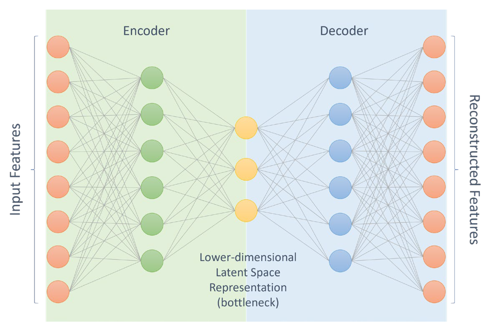

<!-- _class: titlepage -->

# Introducción al aprendizaje profundo

## Aprendizaje profundo

### Departamento de Sistemas Informáticos

#### E.T.S.I. de Sistemas Informáticos - UPM

##### 15 de febrero de 2024

---

# Introducción<!--_class: section-->

---

# ¿Dónde encaja el aprendizaje profundo?

<figure class="image">
  
  <figcaption><strong><em>Figura 1.</em></strong> El aprendizaje profundo es un subconjunto del aprendizaje automático, que es a su vez un subconjunto de la inteligencia artificial.</figcaption>
</figure>

---

# Inteligencia artificial (IA)

Campo de estudio que se ocupa de la creación de sistemas que pueden realizar tareas que requieren inteligencia humana

- Razonamiento, <i>**aprendizaje**</i>, percepción, toma de decisiones, ...
- Se aplica en prácticamente todo campo imaginable
  - Diagnóstico médico, robótica, vehículos autónomos, asistentes personales, sistemas de recomendación, automatización de procesos industriales, ...

Sigue evolucionando rápidamente impulsando la innovación tecnológica

- Está revolucionando cómo interactuamos con el mundo digital y físico
- Plantea importantes cuestiones éticas y sociales
  - Privacidad de los datos, seguridad, desempleo, sesgos, interpretación de los modelos, ...

---

# <!--fit-->Aprendizaje automático (ML, del inglés _machine learning_)

Técnicas que permiten a las máquinas extraer información (aprender) de los datos

- Se trata de un subconjunto de la IA, e implica un cambio de paradigma
  - En lugar de programar las reglas, se entrena un modelo con ejemplos
  - Estos modelos mejoran su desempeño con el tiempo, **sin ser explícitamente programadas para las tareas específica**

¿Qué formas de aprendizaje existen?:

- **Aprendizaje supervisado**: Se entrena con ejemplos etiquetados
- **Aprendizaje no supervisado**: Se entrena con ejemplos no etiquetados
- **Aprendizaje por refuerzo**: Se entrena con un sistema de recompensas

---

# Aprendizaje supervisado

El modelo se alimenta con ejemplos de entradas y sus respectivas salidas

- Entradas: Características, atributos, variables independientes, ...
- Salidas: Etiquetas, resultados, variables dependientes, ...

Su objetivo es modelar la relación existente entre las entradas y las salidas

- El modelo aprende a predecir la salida de nuevos ejemplos no vistos previamente
- Los problemas son de dos tipos: **clasificación** y **regresión**
  - Que en esencia es predecir valores discretos o continuos, respectivamente

Estos modelos se evalúan según su capacidad para predecir **correctamente** las etiquetas de un conjunto de datos de prueba, no visto anteriormente

---

# Aprendizaje supervisado - Clasificación

Dadas unas características de entrada, queremos saber a qué clase pertenece

<figure class="image">
  
  <figcaption><strong><em>Figura 2.</em></strong> Esquema de tarea de clasificación.</figcaption>
</figure>

Principalmente tres tipos: **binaria**, **multiclase** y **multietiqueta**

---

# Aprendizaje supervisado - Regresión

Dadas unas características de entrada, queremos predecir un valor continuo

<figure class="image">
  
  <figcaption><strong><em>Figura 3.</em></strong> Esquema de tarea de regresión.</figcaption>
</figure>

El objetivo es encontrar una función que se ajuste a los datos de entrenamiento

---

# Aprendizaje no supervisado

El modelo se alimenta con ejemplos de entradas, pero **sin etiquetas**

- El objetivo es encontrar patrones, estructuras o relaciones en los datos
- Se utiliza para **agrupar** o **reducir la dimensionalidad** de los datos
- También para **recomendar** o **generar** nuevos datos

Los problemas más comunes son:

- **Clustering**: Agrupar los datos en función de sus características
- **Reducción de la dimensionalidad**: Reducir el número de características
- **Generación de datos sintéticos**: Crear nuevos datos a partir de los existentes

---

# <!--fit-->Aprendizaje no supervisado - Clustering, dimensionalidad y generación

<figure class="image">
  
  <figcaption><em><strong>Figura 4.</strong></em> Un <em>autoencoder</em> es una de las técnicas usadas para clústering, reducción de dimensionalidad y generación de datos sintéticos. Fuente: <a href="https://www.mdpi.com/2076-3417/13/12/7334">Clustering of LMS Use Strategies with Autoencoders</a>1.</figcaption>
</figure>

> 1 Verdú, M. J., Regueras, L. M., de Castro, J. P., & Verdú, E. (2023). [_Clustering of LMS Use Strategies with Autoencoders_](https://www.mdpi.com/2076-3417/13/12/7334). Applied Sciences, 13(12), 7334.

---

# Aprendizaje por refuerzo

El modelo se alimenta con ejemplos de entradas, pero **no con ejemplos de salidas**

- El modelo aprende a través de la interacción con el entorno
- El objetivo es maximizar una recompensa a lo largo del tiempo

Los modelos usan estados, acciones y recompensas para aprender

- Su objetivo es realizar acciones que nos lleven a estados con recompensas altas
  - Intentando que a largo plazo sea alta, aunque a corto plazo sea baja
  - Es el mismo concepto detrás de los juegos de mesa

Suele estar bastante presente en robótica, juegos y simulaciones

---

# <!--fit-->Aprendizaje profundo (DL, del inglés _deep learning_)

Subcategoría del ML, inspirada en la estructura y función del cerebro humano

- Utiliza redes neuronales con muchas capas (profundas) para analizar grandes conjuntos de datos
- Ha impulsado avances significativos en áreas como el reconocimiento de voz e imagen, la traducción automática, la robótica, la medicina, ...

Las técnicas que componen este área:

- Tratan de aprender representaciones útiles y significativas de los datos
  - Las representaciones surgen de la combinación de múltiples capas de procesamiento
- Tratan de sacar conclusiones similares a las que sacarían los humanos

---

# Ideas clave en el aprendizaje profundo

El cerebro compara la información nueva con objetos conocidos

- Es el mismo concepto detrás de las \glspl{ann}

Las capas de una red neuronal artificial (ANN) pueden considerarse filtros

- Estas capas se tienden a estructurar de granularidad más gruesa a más fina
- De esta manera existe mayor probabilidad obtener resultados correctos con mayor exactitud

En general, el DL puede hacer lo mismo que el ML

- Pero a la inversa no se cumple

<!-- https://arxiv.org/pdf/1801.07648.pdf -->

---

# Más ideas clave

Prácticamente _todos_ los últimos avances de la IA se deben al DL

- Está detrás de los servicios cotidianos (p.ej. asistentes digitales)
- También de tecnologías emergentes (p.ej. coches autónomos)
- Parece que estamos viviendo una nueva revolución industrial 2

Prácticamente todos los modelos de DL utilizan ANN

- Por eso suelen denominarse redes neuronales profundas (DNN)
- El término _deep_ se suele referir al número de capas ocultas
  - Tradicionales (_shallow_) $\rightarrow$ de 1 a 3 capas ocultas
  - Profundas (_deep_) $\rightarrow$ Más de 3, ¡incluso cientos!

> 2 Al menos eso indican algunos autores, como con casi cualquier nueva tecnología.

---

# Un poquito de historia<!--_class: section-->

---

# Empezando desde el principio

- **1943**: Modelo de neurona artificial propuesto por McCulloch y Pitts
  - Un modelo electrónico que simula el comportamiento de una neurona
- **1949**: Donald Hebb propone Teoría Hebbiana3
  - Básicamente, las conexiones entre neuronas se fortalecen con el uso y la repetición
- **1958**: Frank Rosenblatt propone el perceptrón4
- **1969**: Un par de hitos interesantes:
  - Minsky y Papert publican _Perceptrons_5
    - Se demostró que las redes neuronales no servían para problemas no lineales y se abandonaron
  - Fukushima, K describe la función de activación ReLU, muy famosa muchos años después6

> 3 Hebb, D. O. (2005). [_The organization of behavior: A neuropsychological theory_](https://pure.mpg.de/rest/items/item_2346268_3/component/file_2346267/content). Psychology press.  
> 4 Rosenblatt, F. (1958). [_The perceptron: a probabilistic model for information storage and organization in the brain_](https://psycnet.apa.org/record/1959-09865-001). Psychological review, 65(6), 386.  
> 5 Minsky, M. L., & Papert, S. A. (1969). [_Perceptrons: An introduction to computational geometry_](https://mitpress.mit.edu/books/perceptrons). MIT press.  
> 6 Fukushima, K. (1969). [_Visual feature extraction by a multilayered network of analog threshold elements_](https://ieeexplore.ieee.org/abstract/document/4082265?casa_token=GLBFBaeNKOsAAAAA:7K0jPlOKh6bxQM1Ih3inoSEIzqHBTNM4lSslNyglRxY5Y_cqxrP_Hl2ZyEx4HcStoRRBx1oG). IEEE Transactions on Systems Science and Cybernetics, 5(4), 322-333.  
---

# Resurgen las redes neuronales

- **1980**: Fukushima K. propone el neocognitron7
  - Modelo de red neuronal convolucional (CNN) inspirado en la corteza visual del cerebro
- **1986**: Rumelhart et al. describen el algoritmo de _back propagation_8 para MLP
- **1989**: Se demuestra que un perceptrón multicapa (MLP) se comporta como **aproximador universal**9
  - Una única capa oculta es capaz de aproximar cualquier función continua de $n$ variables
  - Pero <i>el número de parámetros puede terminar siendo extremadamente alto</i>
  - **Más capas** requieren **menos parámetros** y **aumentan** su capacidad de **generalización**
- **1998**: LeCun et al. aplican _back propagation_ a redes convolucionales (CNN)

> 7 Fukushima, K. (1980). [_Neocognitron: A self-organizing neural network model for a mechanism of pattern recognition unaffected by shift in position_](https://link.springer.com/article/10.1007/BF00344251). Biological cybernetics, 36(4), 193-202.  
> 8 Rumelhart, D. E., Hinton, G. E., & Williams, R. J. (1986). [_Learning representations by back-propagating errors_](https://www.nature.com/articles/323533a0). nature, 323(6088), 533-536.  
> 9 Cybenko, G. (1989). [_Approximation by superpositions of a sigmoidal function_](https://link.springer.com/article/10.1007/BF02551274). Mathematics of control, signals and systems, 2(4), 303-314.  

---

# Comienza la era del aprendizaje profundo

- **2006**: G. Hinton acuña el término de _deep learning_ 10
- **2011**: IBM Watson gana en el concurso Jeopardy (markoff2011computer)
- **2012**: AlexNet gana el desafío ImageNet, revolucionando el campo de la visión artificial11
  - A partir de este momento, **solo los algoritmos de DL ganan el concurso**
- **2014**: Facebook desarrolla DeepFace12; Google compra [DeepMind](https://deepmind.google/)
- **2015**: ResNet13 supera al humano en el ImageNet Contest

> 10 Hinton, G. E., & Salakhutdinov, R. R. (2006). [_Reducing the dimensionality of data with neural networks_](https://www.science.org/doi/abs/10.1126/science.1127647). science, 313(5786), 504-507.. Resolvieron el problema de _vanishing gradients_ usando un proceso iterativo con _autoencoders_ en las primeras capas.  
> 11 Krizhevsky, A., Sutskever, I., & Hinton, G. E. (2012). [_Imagenet classification with deep convolutional neural networks_](https://proceedings.neurips.cc/paper/2012/hash/c399862d3b9d6b76c8436e924a68c45b-Abstract.html). Advances in neural information processing systems, 25. Arquitectura de 8 capas con un **error del 15.3%**. El anterior ganador obtuvo un **26.2%** de error. El ser humano tiene un error aproximadamente el **5%**.  
> 12 Taigman, Y., Yang, M., Ranzato, M. A., & Wolf, L. (2014). [_Deepface: Closing the gap to human-level performance in face verification_](https://openaccess.thecvf.com/content_cvpr_2014/html/Taigman_DeepFace_Closing_the_2014_CVPR_paper.html). In Proceedings of the IEEE conference on computer vision and pattern recognition (pp. 1701-1708).
> 13 He, K., Zhang, X., Ren, S., & Sun, J. (2016). [_Deep residual learning for image recognition_](https://openaccess.thecvf.com/content_cvpr_2016/html/He_Deep_Residual_Learning_CVPR_2016_paper.html). In Proceedings of the IEEE conference on computer vision and pattern recognition (pp. 770-778).  

---

# La era contemporánea

- **2016**: [Alpha Go](https://deepmind.google/technologies/alphago/) (Google DeepMind) vence a Lee Sedol
  - Aprendizaje por refuerzo preentrenado con datos de humanos
- **2017**: [Alpha Go Zero](https://deepmind.google/discover/blog/alphago-zero-starting-from-scratch/) vence a Alpha Go
  - El salto es sustancial, ya que **no se preentrena con datos humanos**
- **2018**: [Alpha Star](https://deepmind.google/discover/blog/alphastar-mastering-the-real-time-strategy-game-starcraft-ii/) vence al mejor jugador de Startcraft II
  - Su primera versión logró colarse entre el 0.2% de los mejores jugadores del mundo
- **2019**: [GPT-2](https://openai.com/research/better-language-models) (OpenAI); modelo de lenguaje con 1.5 billones de parámetros
- **2021**: [DALL-E](https://openai.com/research/dall-e) (OpenAI); modelo de generación de imágenes a partir de texto
- **2023**: [MusicGen](https://musicgen.com/); modelo de generación de música (basado en GPT-3)14
- **2024**: [SORA](https://openai.com/sora) (OpenAI); modelo de generación de video a partir de texto15

> 14 _Copet, Jade, et al. [_Simple and controllable music generation_](https://proceedings.neurips.cc/paper_files/paper/2023/file/94b472a1842cd7c56dcb125fb2765fbd-Paper-Conference.pdf). Advances in Neural Information Processing Systems, 2024, vol. 36._; > Web <https://musicgen.com/> (útimo acceso 19 de febrero de 2024).  
> 15 Informe técnico: [Video generation models as world simulators](https://openai.com/research/video-generation-models-as-world-simulators); Web: <https://openai.com/sora> (útimo acceso 19 de febrero de 2024).  

<!-- https://www.datahack.es/blog/big-data/historia-deep-learning-etapas/ 
    %https://empresas.blogthinkbig.com/una-breve-historia-del-machine-learning/
    %https://www.futurespace.es/machine-learning-los-origenes-y-la-evolucion/
    %https://es.wikipedia.org/wiki/Aprendizaje_profundo
    %https://myclouddoor.com/deep-learning-un-recorrido-historico/
    %https://aprendeia.com/historia-de-machine-learning/
    %https://www.oracle.com/es/database/cloud/algoritmos-machine-learning.html
    %https://blog.nubecolectiva.com/que-es-machine-learning-historia-y-otros-detalles/ -->

---

# El porqué de su popularidad<!--_class: section-->

---

# Razones

En una palabra: **exactitud**

- El DL logra una precisión como nunca antes alcanzada
- Los modelos llegan a superar a los humanos en algunas tareas

Teorizado a mediados de los 1980, pero ahora es útil porque disponemos
de:

1. Cantidades ingentes de datos y la posibilidad de almacenarlos
2. Acceso a una gran potencia de cálculo y técnicas para optimizarlo

Algunos autores y denominan **aprendizaje universal** al DL

- Se debe a que es una técnica útil para casi todos los campos de
aplicación
- El **transfer learning** ayuda a esta concepción de la universalidad

---

# Preprocesamiento de datos (I)

El ML necesita de una fase de extracción e ingeniería de características

- El DL no, sólo requiere de la adaptación de los datos de entrada al modelo

Necesitamos preparar los datos para representarlos

- **Muy** complejo, requiere **mucho conocimiento del dominio**
- Proceso de ensayo y error para obtener resultados óptimos

En DL no es necesario un paso de preprocesamiento de datos

- El modelo aprende a representar los datos brutos por sí misma
- Cada capa aprende una representación cada vez más abstracta
- Se optimiza automáticamente durante el entrenamiento

---

# Preprocesamiento de datos (II)

<figure class="image">
  
  <figcaption><em><strong>Figura 5.</strong></em> Un proceso de aprendizaje automático requiere una fase de selección de características.</figcaption>
</figure>

<figure class="image">
  
  <figcaption><em><strong>Figura 6.</strong></em> El aprendizaje profundo no requiere de dicha fase, ya que el propio modelo es capaz de inferir las características relevantes para el problema en cuestión.</figcaption>
</figure>

---

# Big data

Los modelos de ML tradicional dejan de mejorar a partir de un punto

- **Punto de saturación**, donde la precisión ya no mejora añadiendo más datos

Los algoritmos de DL son menos sensibles al punto de saturación

- Añadir más datos tiende a producir una mejora en la exactitud (_accuracy_)
- En la era del **Big Data** es una gran ventaja
  - Nunca hemos tenido tantos datos disponibles ni tanta capacidad de cómputo como ahora

Los algoritmos de DL escalan en términos de datos y, sobre todo, de cómputo

- Por ejemplo, ResNet se implementó a escala de supercomputación
- Se ha demostrado que el DL puede escalar a cientos de miles de núcleos

---

# Big data

<figure class="image">
  
  <figcaption><em><strong>Figura 7.</strong></em> Relación entre capacidad de aprendizaje y volumen de datos en modelos estadísticos, de aprendizaje automático y de aprendizaje profundo (redes neuronales).</figcaption>
</figure>

---

# Ventajas y desventajas del aprendizaje profundo

## Ventajas

- Capacidad de **aprender y adaptarse** (mejorar) de forma independiente
- **Aplicable** en casi cualquier campo y **sobre cualquier problema**
- **Superación de la capacidad humana** en tareas específicas
- **Revolución en múltiples sectores** (medicina, automoción, finanzas,
etc.)

## Inconvenientes

- Necesidad de <i>**muchos datos**</i>
- Altísimo <i>**coste computacional**</i> y por tanto, <i>**impacto medioambiental**</i>
- Prácticamente <i>**imposible interpretar o explicar**</i> los modelos generados
- Riesgo de <i>**perpetuación de sesgos existentes**</i> en los datos de entrenamiento

---

# Areas de aplicación<!--_class: section-->

---

# Áreas de aplicación del aprendizaje profundo

Hemos visto que al DL se le suele denominar «método de aprendizaje
universal»

- Esto es porque es potencialmente aplicable a todos los campos
- De hecho **hoy en día se aplica a casi todos los campos conocidos**

Usados normalmente donde se requieren habilidades humanas

- Por ejemplo, la visión, reconocimiento del habla o del entorno
- Y no hay disponible un humano para realizar las tareas
  - O lo hay, pero sería tremendamente ineficiente ... o imposible

A continuación veremos algunos ejemplos de aplicaciones del DL

---

# Robótica (I)

Una de las áreas en las que el DL ha tenido más impacto

- Percepción de obstáculos y path planning inmediato
- Tareas de estabilidad y control7
- Robots industriales con visión artificial
- Apoyo a sistemas de mantenimiento predictivo
- Asistencia a la comunicación intra e inter-robot
- Robótica de servicio y asistencial

> 7 Los robots de Boston Dynamics, hasta cayéndose lo hacen con estilo. Imagen extraída de <https://youtu.be/aX7KypGlitg> (The Independent)

---

# Robótica (II)

Los coches autónomos son una de las tecnologías en auge gracias al DL

- Detección y seguimiento de objetos alrededor del vehículo8
- Ubicación en la calzada
- Identificación de las señales de tráfico
- Análisis en tiempo real del estado del conductor o del vehículo
- Asistencia a la comunicación intra e inter-vehicular

> 8 Imagen extraída de _Zheng, Jingxiao, et al. [Multi-modal
> 3d human pose estimation with 2d weak supervision in autonomous
> driving](https://openaccess.thecvf.com/content/CVPR2022W/WAD/html/Zheng_Multi-Modal_3D_Human_Pose_Estimation_With_2D_Weak_Supervision_in_CVPRW_2022_paper.html).
> En Proceedings of the IEEE/CVF Conference on Computer Vision and
> Pattern Recognition. 2022. p. 4478-4487._

---

# Texto y lenguaje

El DL es ideal para las tareas de NLP

- Las herramientas que lo usan son órdenes de magnitud más avanzadas
- Aprovecha muy bien la habilidad del DL para extraer características

Algunas aplicaciones dentro del área incluyen:

- Entender la actitud de un actor mediante el análisis del lenguaje
usado9
- Filtrado de información en función de parámetros sociales,
geográficos, económicos y preferencias individuales10
- Generación de texto en lenguaje natural desde información no
estructurada11

> 9 Ejemplo: <https://monkeylearn.com/sentiment-analysis-online/>  
> 10 Ejemplo: <https://www.facebook.com/Engineering/videos/10154132641047200>  
> 11 Ejemplos: <https://play.aidungeon.io>,
> <https://www.projectelectricsheep.com/> o
> <https://www.usetopic.com/blog-idea-generator>

---

# Visión artificial

El _deep learning_ permite el reconocimiento visual de imágenes a gran escala

- Abstrae prácticamente todo esfuerzo manual en el proceso
- Permite identificar características en grandes conjuntos de datos
- En definitiva, está impulsando el crecimiento de muchas áreas
  - Es esencial en todo sistema que requiera visión (p.ej. coches autónomos)
  - Segmentación de tumores cerebrales12
  - Sistemas de reconocimiento de expresión facial13
  - Reconocimiento biométrico a través del iris del ojo. DeepIris14

> 12 _Ranjbarzadeh, Ramin, et al. [Brain tumor segmentation
> of MRI images: A comprehensive review on the application of artificial
> intelligence tools](https://www.sciencedirect.com/science/article/pii/S0010482522011131?casa_token=Z2EtkAliNNUAAAAA:uFprgO00JQMrNWrU9mpbQ2eiPCYVaK3VARcqvw0BUOIaf2i3txxAwKXjVzkhVr_bYGOgj3iv).
> Computers in biology and medicine, 2023, vol. 152, p. 106405._  
> 13 Hassan, Syed Muhammad, et al. [An Effective Combination
> of Textures and Wavelet Features for Facial Expression
> Recognition](https://www.etasr.com/index.php/ETASR/article/view/4080).
> Engineering, Technology & Applied Science Research, 2021, vol. 11, no
> 3, p. 7172-7176.  
> 14 _Tamizhiniyan, S. R., et al. [DeepIris: An ensemble
> approach to defending Iris recognition classifiers against Adversarial
> Attacks](https://ieeexplore.ieee.org/abstract/document/9402404?casa_token=8IiGXrc_31gAAAAA:oXrnsu_zc-Z62utFhwbUCHghlqCVNxV-BIjI4ZOXfdbRH-JPcPQlDTtWH2_SFsa4c1UcoSR-).
> En 2021 International Conference on Computer Communication and
> Informatics (ICCCI). IEEE, 2021. p. 1-8._

---

# Asistentes virtuales

Son aplicaciones que entienden los comandos en lenguaje natural

- Amazon Alexa, Cortana, Siri, Google Assistant, ...
- Personalizan la experiencia de usuario en base al histórico
- Aprenden con cada interacción, sobre todo en reconocimiento
- Otras capacidades: Traducción de discurso a texto, toma de notas,
gestión de citas

Los _chatbot_ (p.ej. ChatGPT) son asistentes virtuales específicos para
chatear

- Interacción con clientes y marketing en las redes sociales
- Ofrecen atención al cliente inmediata y personalizada
- Algunos ejemplos:
  - <a href="https://telegram.me/andyrobot">Andy Robot</a>, _chatbot_
para aprender inglés en Telegram
  - Alerta de Salud de la OMS: WhatsApp al +41 797 818 791 con
<code>'Hi'</code>

---

# Salud

Una de las mayores tendencias actuales es en el área de la
salud15

- En el área de la atención sanitaria
  - Ayuda al diagnóstico por rayos X (waheed2020covidgan,narin2021automatic)
  - Análisis en tiempo real de datos agregados de sensores (philip2021deep)
  - Diagnósticos y tratamientos personalizados por paciente (oh2021deep)
  - Identificación de trastornos del desarrollo como el autismo~ (heinsfeld2018identification)
- En el área farmacéutica
  - Descubrimiento de fármacos (predicción de sus efectos) (gawehn2016deep,chen2018rise)

> 15 Piccialli, Francesco, et al. [Artificial intelligence
> and healthcare: Forecasting of medical bookings through multi-source
> time-series fusion](https://www.sciencedirect.com/science/article/pii/S1566253521000592?casa_token=ZP3DQvK_iIcAAAAA:hQkw5f86hUqi-Uw7hq2HsTLIs5Q1WvVtYksGJUfIasBS_p-X4eQC_bIKsBCUV_X3vWaTMaVO).
> Information Fusion, 2021, vol. 74, p. 1-16.

---

# Generación de contenido

Otra de las áreas es la modificación o generación total de contenido

- [WaveNet](https://deepmind.com/blog/article/wavenet-generative-model-raw-audio)
analiza y sintetiza señales de audio similares (oord2016wavenet)
- AutoFoley crea efectos de audio a partir de vídeos mudos (ghose2020autofoley)
- [NeuralFunk](https://towardsdatascience.com/neuralfunk-combining-deep-learning-with-sound-design-91935759d628)
genera pistas de audio de longitud indefinida
- Generación de rostros realistas pero inexistentes (karras2017progressive)
- Generación de los momentos más destacados en competiciones, p.ej.
Wimbledon (merler2018automatic)
- Vídeos e imágenes «ultrafalsas» (thies2016face2face)
- [DeepDream](https://deepdreamgenerator.com/) genera imágenes
psicodélicas a partir de su conocimiento

---

# Y muchas más áreas

- Ciberseguridad
- Realidad virtual y aumentada
- Simulación y videojuegos
- Ciencias sociales
- Finanzas y bolsa

---

# Limitaciones y retos<!--_class: section-->

---

# <!--fit-->Limitaciones y retos de los modelos de _deep learning_ (I)

Los requisitos de hardware

- Los modelos requieren cada vez más memoria y capacidad de cómputo
- Las GPU y TPU son muy caras, además del impacto energético y medioambiental

Los modelos más potentes usan cada vez más parámetros

- Esto es, cada vez conjuntos de datos más grandes, que no siempre tenemos
- A veces se emplean en datos sintéticos, pero no siempre es válido usarlos

Los modelos, una vez entrenados, se vuelve inflexibles

- Soluciones eficientes, pero para problemas concretos
- Es muy típico que un problema similar requiera de un nuevo entrenamiento

---

# <!--fit-->Limitaciones y retos de los modelos de _deep learning_ (II)

Los modelos de _deep learning_ aprenden mediante observaciones

- Solo saben lo que existe en los datos con los que se ha entrenado
- Una muestra no representativa hace que el modelo no generalice

Los datos suelen estar sesgados (consciente o inconscientemente)

- Si existen sesgos en los datos, existirán en las predicciones
- Los modelos aprenden a partir de variaciones que, a veces, no son explícitas
- Una decisión errónea/poco ética puede impactar negativamente en el mundo real
- No existe (por ahora) forma clara de explicar el razonamiento tras cada predicción
  - La imposibilidad de explicación hace todavía más difícil detectar estos problemas de sesgo

---

## <!--fit-->Inteligencia artificial explicable (XAI, del inglés _explainable AI_)<!--_class: section-->

---

# ¿Cuál es el problema de la XAI?

Los modelos funcionan como una caja negra

- Aprenden relaciones y razonan a través de ellas
- Estas tienen poco o nada que ver con el razonamiento humano
  - No entraremos en el debate de si este es o no simbólico
- Aun errónea, no sabríamos el porqué ni cómo contraargumentar una decisión

Estas decisiones pueden tener un <i>**impacto social o medioambiental**</i>

- Diagnóstico médico donde se determina una enfermedad
- Concesión o no de un crédito en función de ciertos parámetros
- Emisión de veredictos judiciales
- Frenar o no ante humanos en un paso de peatones

---

# Sobre la inteligencia artificial explicable

Es el conjunto de técnicas y métodos para explicar las decisiones de algoritmos de IA, teniendo en cuenta:

1. Naturaleza del modelo, que comprende dos extremos
   - Modelos totalmente transparentes como los árboles de decisión
   - Modelos de caja negra como Artificial Neural Network (ANN)
2. Público objetivo, que afecta en dos dimensiones diferentes
   - Nivel de detalle
   - Forma de presentación

---

# Conclusiones<!--_class: section-->

---

# Conclusiones

El aprendizaje profundo se utiliza extensivamente en la industria

- Cada vez más organizaciones lo están adoptando para seguir siendo competitivas

El la última década ha habido un gran avance en el DL, principalmente por:

- La amplia disponibilidad del _big data_,
- La potencia computacional, y
- Nuevas técnicas que han mejorado los modelos convencionales en varios órdenes de magnitud

Aun así, hay muchas aplicaciones a las que no se debería delegar las decisiones debido a su potencial impacto en la vida de las personas

---

<!--_class: license -->
# Licencia

Esta obra está licenciada bajo una licencia [Creative Commons Atribución-NoComercial-CompartirIgual 4.0 Internacional](https://creativecommons.org/licenses/by-nc-sa/4.0/).

Puede encontrar su código en el siguiente enlace: <https://github.com/etsisi/Aprendizaje-profundo>
