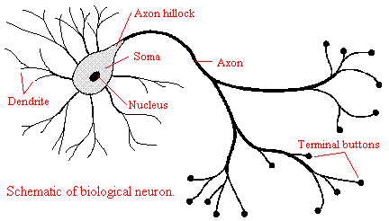
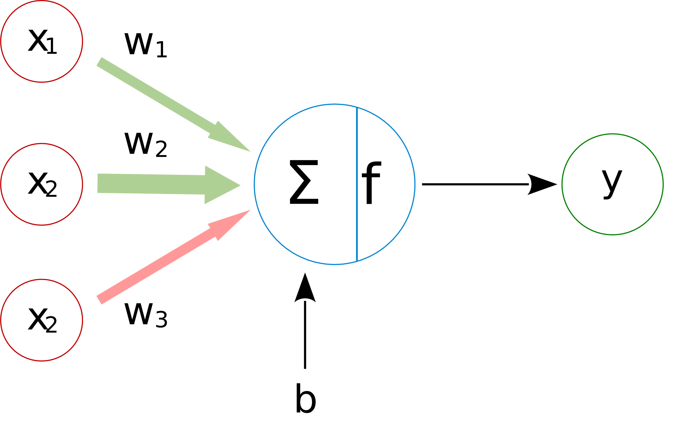

<!-- _class: titlepage -->

# Redes neuronales artificiales

## Aprendizaje profundo

### Departamento de Sistemas Informáticos

#### E.T.S.I. de Sistemas Informáticos - UPM

##### 2 de marzo de 2024

---

# Conceptos generales (I)

Las redes neuronales (ANN, del inglés _artificial neural networks_) son un modelo computacional inspirado en el funcionamiento del cerebro humano

- Están formadas por un conjunto de nodos (neuronas) interconectados
- Cada neurona recibe una serie de entradas, las procesa y produce una salida
- Las conexiones tienen un peso que modifica la influencia de la entrada en la salida
- **La red se entrena ajustando los pesos de las conexiones para <i>minimizar el error</i> de la salida**

La misma red neuronal puede adaptarse para diferentes tipos de entrada (imágenes, texto, numéricos) y obtener buenos resultados

---

# Conceptos generales (II)

El proceso de funcionamiento de una red neuronal es el siguiente

1. Introducimos unos datos de entrada en la red
2. Realizamos la predicción, obteniendo la salida
   - También inferencia, propagación hacia adelante o, simplemente, propagación
3. Si estamos en el proceso del entrenamiento de la red, además:
   1. Comparamos la predicción con la salida esperada, viendo el error
      - Esto sólo en el caso de un esquema de entrenamiento supervisado
   2. Ajustamos los parámetros internos para tratar de minimizar ese error y mejorar las futuras predicciones

Los datos se almacenan como vectores y matrices, por eso es útil el hardware destinado a cálculos matriciales como las GPU

---

# Neurona artificial o <i>perceptrón</i>

Modelo matemático que **simula el comportamiento de una neurona biológica**

1. Toma las entradas $x_1, x_2, \ldots, x_n$, cada una con su peso $w_1, w_2, \ldots, w_n$
2. Aplica una función de activación a la suma ponderada de las entradas y los pesos

  

    <figure class="image">
      
      <figcaption><em><strong>Figura 1.</strong></em> Esquema de neurona biológica.</figcaption>
    </figure>
  

  

    <figure class="image">
      
      <figcaption><em><strong>Figura 2.</strong></em> Esquema de neurona artificial.</figcaption>
    </figure>
  

---

# Inferencia

Obtención de la salida a partir de la suma ponderada de las entradas y sus pesos

  

    <figure class="image">
      
      <figcaption><em><strong>Figura 3.</strong></em> La salida se obtiene en <strong>función</strong> de la suma ponderada de las entradas.</figcaption>
    </figure>
  

  

Dos formas de obtener la salida:

1. **Escalar**
  $$ŷ = f\left(\sum_{i=1}^n w_i x_i\right)$$
2. **Forma vectorial**
  $$ŷ = f\left(W X\right)$$

Ambas formas **son equivalentes**

<!-- No vendría de más describir en una (o dos, pero como mucho) la regla delta, así quedaría mucho más completo -->

---

# Múltiples salidas (I)

Varias salidas para una misma entrada es equivalente a tener varias neuronas

  

    <figure class="image">
      
      <figcaption><em><strong>Figura 4.</strong></em> Múltiples salidas para una misma entrada es, en esencia, varios perceptrones.</figcaption>
    </figure>
  

  

Las entradas siguen siendo un vector $X$
$$
X = \begin{bmatrix} x_1 & x_2 & \ldots & x_n \end{bmatrix}
$$

Los pesos de la red serán una **matriz** $W$

$$
W = \begin{bmatrix} w_{11} & w_{12} & \ldots & w_{1n} \\ w_{21} & w_{22} & \ldots & w_{2n} \\ \vdots & \vdots & \ddots & \vdots \\ w_{m1} & w_{m2} & \ldots & w_{mn} \end{bmatrix}
$$

---

# Múltiples salidas (II)

Varias salidas para una misma entrada es equivalente a tener varias neuronas

  

    <figure class="image">
      
      <figcaption><em><strong>Figura 4.</strong></em> Múltiples salidas para una misma entrada es, en esencia, varios perceptrones.</figcaption>
    </figure>
  

  

La salida será

$$\hat{y} = f\left(W X\right) = \begin{bmatrix} \hat{y}_1 \\ \hat{y}_2 \\ \vdots \\ \hat{y}_m \end{bmatrix}$$

Es decir, una inferencia por neurona

- Esta estructura se conoce como **capa**
- Cobrará importancia más adelante

---

# Perceptrón<!--_class: accent-->

## Notebook: [Perceptrón simple y perceptrón multicapa.ipynb](https://etsisi.github.io/Aprendizaje-profundo/Notebooks/Perceptrón%20simple%20y%20perceptrón%20multicapa.ipynb)

---

# Funciones de activación (i)

Son quienes determinan la salida de la neurona; algunos ejemplos son:

### Funciones escalón

- **Heaviside**: $f(x) = \begin{cases} 0 & \text{si } x < 0 \\ 1 & \text{si } x \geq 0 \end{cases}$
- **Signo**: $f(x) = \begin{cases} -1 & \text{si } x < 0 \\ 0 & \text{si } x = 0 \\ 1 & \text{si } x > 0 \end{cases}$

### Funciones lineales

- **Identidad**: $f(x) = x$
- **Lineal**: $f(x) = ax + b$

### Funciones sigmoide

- **Logística**: $f(x) = \frac{1}{1 + e^{-x}}$
- **Tan. hiperbólica**: $f(x) = \tanh(x)$

### Funciones rectificadas

- **ReLU**: $f(x) = \max(0, x)$
- **Leaky ReLU**: $f(x) = \max(\alpha x, x)$

### Funciones de activación suaves

- **Softmax**: $f(x) = \frac{e^{x_i}}{\sum_{j=1}^n e^{x_j}}$

---

# Funciones de activación (II)

<figure class="image">
  
  <figcaption><em><strong>Figura 5.</strong> Algunas funciones de activación comunes.</em></figcaption>
</figure>

---

# Estimación de error o _loss_

El error de la red se mide con una función de pérdida (_loss function_)

- Mide la diferencia entre la salida de la red y la salida esperada
- El objetivo es minimizar esta función
- Algunas funciones de pérdida comunes son:
  - **Error cuadrático medio**: $\frac{1}{n} \sum_{i=1}^n (y_i - \hat{y}_i)^2$
  - **Entropía cruzada**: $-\sum_{i=1}^n y_i \log(\hat{y}_i)$
  - **Error absoluto medio**: $\frac{1}{n} \sum_{i=1}^n |y_i - \hat{y}_i|$
- La elección de la función de pérdida depende del problema a resolver
- En general, se busca que sea derivable para poder aplicar algoritmos de optimización

---

# Métricas <!--_class: accent-->

## Notebook: [Métricas para problemas de clasificación y regresión.ipynb](https://etsisi.github.io/Aprendizaje-profundo/Notebooks/Métricas%20para%20problemas%20de%20clasificación%20y%20regresión.ipynb)

---

# Entrenamiento de redes neuronales<!--_class: section-->

---

# ¿En qué consiste el entrenamiento?

Consiste en ajustar los pesos de las conexiones para minimizar el error

Para aumentar su fiabilidad, se suele realizar una división de tres conjuntos:

1. **Entrenamiento**: Ajuste de parámetros (pesos)
2. **Validación**: Ajuste de hiperparámetros
3. **Test**: Validación una vez finalizado el entrenamiento

El conjunto de validación se usa **durante el entrenamiento**

- El conjunto de test se utiliza **al final del entrenamiento**

<figure class="image">
  
  <figcaption><em><strong>Figura 6.</strong> Diferentes conjuntos de datos.</em></figcaption>
</figure>

---

# Problemas de ajuste (I)

Compromismo sesgo-varianza (_bias-variance tradeoff_): Dos métricas que ayudan a evaluar el comportamiento de un modelo:

- **Sesgo** (_bias_): Error por suposiciones incorrectas en el modelo
- **Varianza** (_variance_): Error por la sensibilidad del modelo a variaciones en los datos

<figure class="image">
  
  <figcaption><em><strong>Figura 7.</strong> Ilustración del compromiso <em>>bias</em>-<em>variance</em>. Fuente: <a href="https://www.datasciencecentral.com/bias-variance-trade-off/">Data Science Central</a></em></figcaption>
</figure>

---

# Problemas de ajuste (II)

**Sesgo** y **varianza** son dos fuentes de error que afectan a los modelos de ML

<figure class="image">
  
  <figcaption><em><strong>Figura 8.</strong> Sesgo y varianza en función de la complejidad del modelo. Fuente: <a href="https://en.wikipedia.org/wiki/Bias%E2%80%93variance_tradeoff">Wikipedia</a></em></figcaption>
</figure>

---

# Problemas de ajuste (III)

No posible minimizar <i>**el sesgo y la varianza a la vez**</i>

## Sesgo alto

- Subajuste (_underfitting_)
- **Sobresimplificación** del problema
- _Losses_ demasiado altos
- No captura la tendencia de los datos

## Varianza alta

- Sobreajuste (_overfitting_)
- **Sobrecomplicación** del problema
- _Dataset_ demasiado ruidos
- Demasiada complejidad

---

# <!--fit-->Compromiso sesgo-varianza en el entrenamiento (I)

El objetivo del entrenamiento es encontrar un **equilibrio entre sesgo y varianza**

<figure class="image">
  
  <figcaption><em><strong>Figura 8.</strong> Proceso de entrenamiento de un modelo teniendo en cuenta el compromiso sesgo-varianza.</em></figcaption>
</figure>

---

# <!--fit-->Compromiso sesgo-varianza en el entrenamiento (II)

## ¿Cómo reducimos sesgo?

- Más entrenamiento
- Cambiar de arquitectura
- Aumentar complejidad del modelo
  - Añadir neuronas
  - Añadir capas
- ...

## ¿Cómo reducimos varianza?

- Aumentar el _dataset_
- Cambiar de arquitectura
- Regularización
  - _Dropout_
  - $L1$, $L2$, ...
- Menos entrenamiento
- ...

---

# Técnicas de regularización<!--_class: section-->

---

# Regularización

Es el proceso por el cual se **evita el sobreajuste** de un modelo

- Regularización $\mathcal{L1}$ y $\mathcal{L2}$
- Decaimiento de pesos
- _Dropout_
- _Batch normalization_
- _Data augmentation_
- _Early stopping_

---

# Regularización $\mathcal{L1}$

La idea de estas técnicas es reducir el valor de los parámetros para que sean pequeños

- Introduce una **penalización** a la <i>función de corte</i> $\mathcal{L}$, añadiendo a su valor el valor absoluto de los parámetros ($\omega$)

$$
\mathcal{L1}(X, \omega) = L(X,\omega) + \lambda \sum{| \omega |}
$$

- $\lambda$ es un parámetro que controla la fuerza de la regularización

$\mathcal{L1}$ «empuja» el valor de los parámetros hacia valores muy pequeños pequeños

- Hay que tener cuidado que podemos anular valores de entrada a la red.
- Se puede ver como una suerte de selección de variables automática

---

# Regularización $\mathcal{L2}$

Es una técnica muy parecida a la anterior donde los parámetros usan el cuadrado de los parámetros en lugar del valor absoluto

$$
\mathcal{L2}(X, \omega) = L(X,\omega) + \lambda \sum{\omega_i^2}
$$

- Mediante el parámetro $\lambda$ podemos ajustar la regularización

El resultado de $\mathcal{L1}$ y $\mathcal{L2}$ es una mejor generalización (hasta cierto punto)

---

# _Dropout_

Esta técnica **desactiva neuronas** de la red **durante el entrenamiento** de forma aleatoria

<figure class="image">
  
  <figcaption><em><strong>Figura 9.</strong> Ejemplo de actuación del dropout durante un entrenamiento.</em></figcaption>
</figure>

Deactivando neuronas, la red se **obliga a aprender** de forma más robusta

- Esto es, repartiendo el conocimiento de todos los ejemplos entre todas las neuronas

---

# Dropout<!--_class: accent-->

## Notebook: [Regularización dropout.ipynb](https://etsisi.github.io/Aprendizaje-profundo/Notebooks/Regularización%20dropout.ipynb)

---

# _Batch normalization_

Es una técnica que **normaliza** las salidas de las neuronas añaadiendo una capa extra entre las neuronas y la función de activación

- Ocasiona que el rango de la entrada escale fácilmente hasta el rango de salida, lo que ayudará y reducirá las oscilaciones de la función de coste
- Como consecuencia de esto podremos aumentar la tasa de aprendizaje (no hay tanto riesgo de acabar en un mínimo local) y la convergencia hacia el mínimo global se producirá más rápidamente.

<i>**Cuidado**</i>: No siempre beneficia a nuestra red, hay estudios que describen una mayor tendencia a la aparición de problemas de desvanicimiento del gradiente

---

# _Data augmentation_

Consisite en aumentar el tamaño del dataset de entrenamiento de forma sintética

- En realidad no es un algoritmo de regularización, sino una estrategia
- Al aumentar el tamaño del conjunto de datos, se reduce el riesgo de sobreajuste

Los métodos más comunes para dataset de imágenes son:

- Voltear la imagen en horizontal / vertical
- Rotar la imagen X grados.
- Recortar, añadir relleno, redimensionar, ...
- Introducir ruido, defectos, ...

En la actualidad disponemos de modelos de DL capaces de generar datos sintéticos más fieles a la realidad

---

# Problemas del gradiente<!--_class: section-->

---

# ¿Qué pasa con el gradiente?

El gradiente es la herramienta principal para ajustar los pesos de la red

$$
W_{t+1} = W_t - \alpha \frac{\partial L}{\partial W_t}
$$

1. Al entrenar, usamos algoritmos de descenso del gradiente para minimizar el error
2. En $n$ capas, el gradiente se propaga hacia atrás, ajustando los pesos de la red
3. Dependiendo del valor de estos gradientes, esta acumulación puede hacer los valores se descontrolen:
   - Derivadas pequeñas $\rightarrow$ El gradiente <i>**disminuye**</i> exponencialmente (**desvanecimiento del gradiente**)
   - Derivadas grandes $\rightarrow$ El gradiente <i>**aumenta**</i> exponencialmente (**explosión del gradiente**)

Afortunadamente, hay soluciones para estos problemas

---

# Desvanecimiento y explosión del gradiente

Están directamente influenciados por el número de capas que posee una red

1. **Desvanecimiento del gradiente**: Los pesos de las primeras capas no se actualizan
2. **Explosión del gradiente**: Los pesos de las primeras capas se actualizan en exceso

En la retropropagación se propagan los errores desde la salida hasta la entrada

- La acumulación de valores puede hacer que las derivadas de las funciones de activación se descontrolen

---

# <!--fit-->Desvanecimiento del gradiente (_vanishing gradient_) (I)

<figure class="image">
  
  <figcaption><em><strong>Figura 11.</strong> En sus extremos la derivada de la sigmoida el casi 0. Fuente: <a href="https://neptune.ai/blog/vanishing-and-exploding-gradients-debugging-monitoring-fixing">neptune.ai</a>.</em></figcaption>
</figure>

Ocurre al usar funciones de activación con derivada **muy pequeña**

- Tangente hiperbólica y sigmoide

Se prefieren **ReLU** o **Leaky ReLU**:

- Son más estables y no sufren de saturación
- La derivada de ReLU y LeakyReLU es 1 si $x > 0$
- Ambas siguen siendo no lienales

Se identifica cuando el _loss_ no disminuye o lo hace muy lentamente

---

# <!--fit-->Desvanecimiento del gradiente (_vanishing gradient_) (II)

Algunas posibles soluciones para resolver este problema son las siguientes:

- Reducir la cantidad de capas, propagando así menos errores
- Elección cuidadosa de los pesos de inicialización de la red
- Usar funciones de activación alternativas, como ReLU o Leaky ReLU
- Uso de arquitecturas como las redes residuales1

> 1 He, K., Zhang, X., Ren, S., & Sun, J. (2016). [_Deep residual learning for image recognition_](https://openaccess.thecvf.com/content_cvpr_2016/html/He_Deep_Residual_Learning_CVPR_2016_paper.html). In Proceedings of the IEEE conference on computer vision and pattern recognition (pp. 770-778).

---

# <!--fit-->Desvanecimiento del gradiente (_vanishing gradient_) (III)

<figure class="image">
  
  <figcaption><em><strong>Figura 12.</strong> Bloque residual de una red residual, donde la entrada se salta una capa para propagar el error evitando. Fuente: <a href="https://es.wikipedia.org/wiki/Red_neuronal_residual">Wikipedia</a>.</em></figcaption>
</figure>

---

# Explosión del gradiente (_exploding gradient_)

Ocurre cuando las derivadas de las funciones de activación son **muy grandes**

<figure class="image">
  
  <figcaption><em><strong>Figura 13.</strong> Ilustración de la explosión del gradiente.</em></figcaption>
</figure>

Se identifica con valores de _loss__ de NaN o muy exagerados

---

# Ejercicios sugeridos<!-- _backgroundColor: lightblue -->

- [Comparación de rendimiento de modelos](https://etsisi.github.io/Aprendizaje-profundo/Exercises/Redes%20neuronales%20artificiales%20-%20Clasificación%20de%20diabetes.ipynb)
- [Clasificación de diabetes](https://etsisi.github.io/Aprendizaje-profundo/Exercises/Redes%20neuronales%20artificiales%20-%20Comparación%20de%20rendimiento%20de%20modelos.ipynb)

---

# Licencia<!--_class: license -->

Esta obra está licenciada bajo una licencia [Creative Commons Atribución-NoComercial-CompartirIgual 4.0 Internacional](https://creativecommons.org/licenses/by-nc-sa/4.0/).

Puedes encontrar su código en el siguiente enlace: <https://github.com/etsisi/Aprendizaje-profundo>
