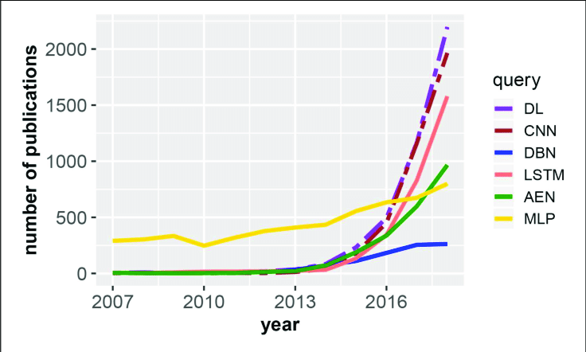
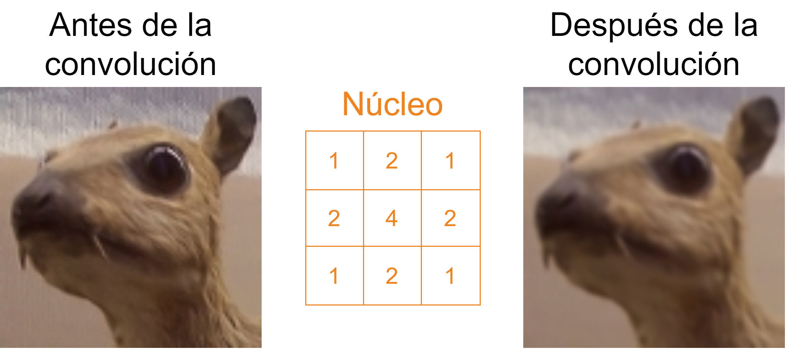
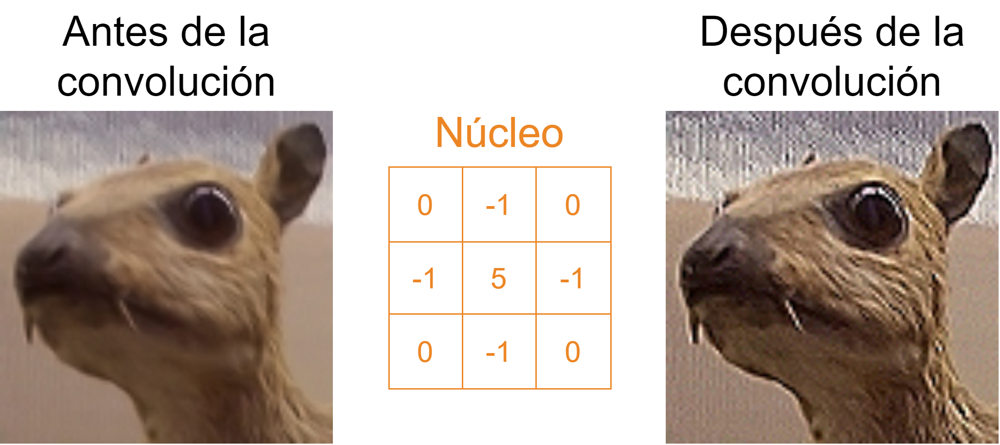
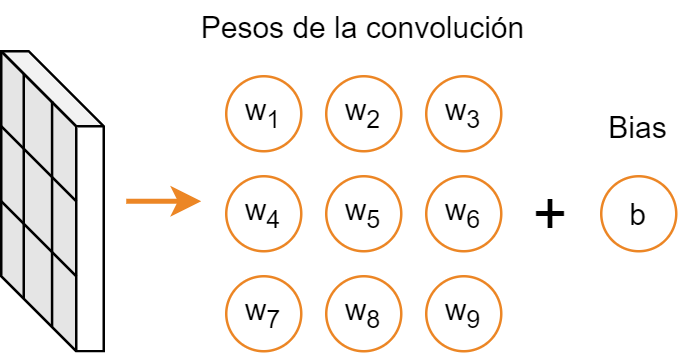
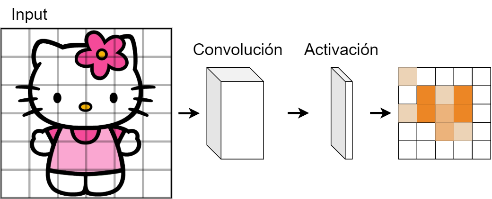
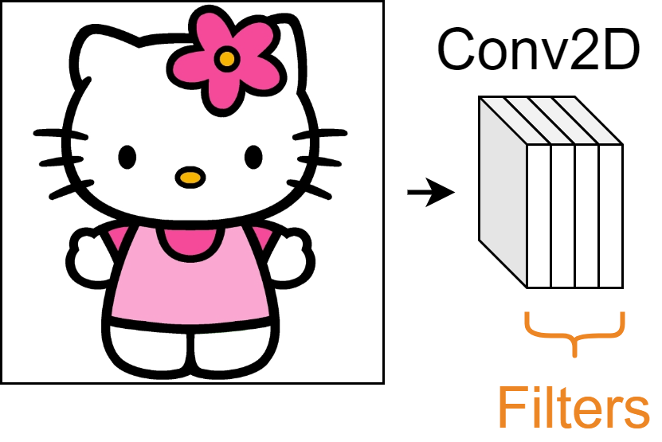
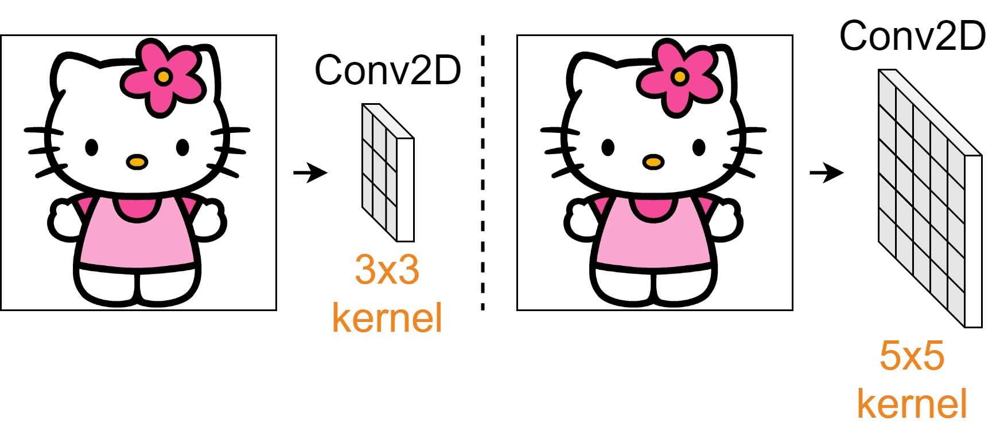
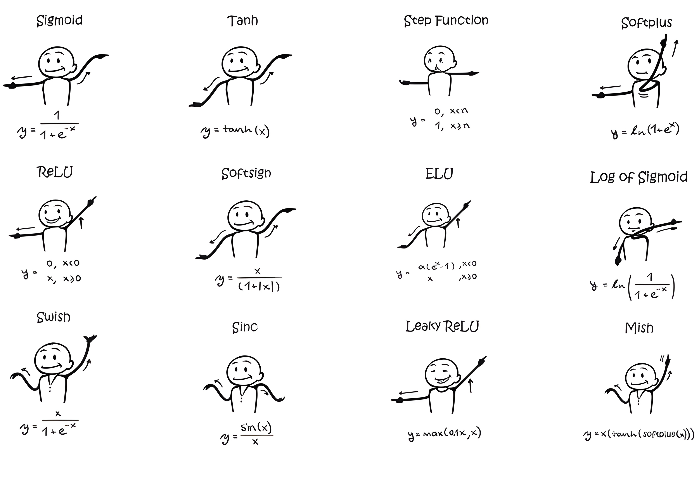

<!-- _class: titlepage -->

# Redes neuronales convolucionales

## Aprendizaje profundo

### Departamento de Sistemas Informáticos

#### E.T.S.I. de Sistemas Informáticos - UPM

##### 5 de marzo de 2024

[](https://creativecommons.org/licenses/by-nc-sa/4.0/)

---

# Contexto actual

Las redes convolucionales (CNN) son una de las principales arquitecturas usadas

<figure>
    
    <figcaption>Tendencia de diferentes técnicas de deep learning a lo largo de los años. Fuente: <em>An Introductory Review of Deep Learning for Prediction Models With Big Data</em></figcaption>
</figure>

Son la técnica predominante a la hora de procesar <i>imágenes</i> y <i>datos tabulares</i>

> <sup>1</sup> Emmert-Streib, F., Yang, Z., Feng, H., Tripathi, S., & Dehmer, M. (2020). [_An introductory review of deep learning for prediction models with big data_](https://www.frontiersin.org/articles/10.3389/frai.2020.00004/full). Frontiers in Artificial Intelligence, 3, 4.

---

# Motivación

Surgen para adaptar las redes neuronales al tratamiento de imágenes

- Aprovechan las características de los datos espaciales para reducir el número de parámetros de la red
- Aprenden la invarianza de los datos, lo que les permite generalizar mejor
- Son capaces de extraer características jerárquicas de los datos, ayudando a identificar patrones complejos

Se apoyan en la operación de <i>**convolución**</i> para procesar los datos

---

# Arquitecura de una CNN

Se de dos partes para el proceso de datos espaciales:

1. **Extracción de características**: Capas de convolución, _pooling_ y normalización
2. **Inferencia**: Capas densas (MLP)

<figure>
    
    <figcaption>Arquitectura de una CNN. Fuente: <a href="https://www.analyticsvidhya.com/blog/2020/10/what-is-the-convolutional-neural-network-architecture/">Analytics Vidhya</a></figcaption>
</figure>

---

# Operación de convolución<!--_class: section-->

---

# ¿Qué es una operación de convolución?

En nuestro contexto definiremos la convolución como operación que **procesa una matriz numérica manteniendo las relaciones espaciales de la misma**

- Se aplica un **filtro** (o **kernel**) a la matriz de entrada produciendo una salida denominada **mapa de características**
- En visión artificial, se han utilizado tradicionalmente para producir efectos

---

# Ejemplo de convolución: Desenfoque tipo caja

<figure>
    
    <figcaption>Ejemplo de desenfoque tipo caja.</figcaption>
</figure>

---

# Ejemplo de convolución: Desenfoque tipo caja

<figure>
    
    <figcaption>Ejemplo de desenfoque gaussiano.</figcaption>
</figure>

---

# Ejemplo de convolución: Desenfoque tipo caja

<figure>
    
    <figcaption>Ejemplo de desenfoque realce de bordes.</figcaption>
</figure>

---

# Operación de convolución (I)

**Producto escalar** de una matriz con un **filtro** (**kernel**) que se desplaza por ella

<hr>
<div class="columns">
<div class="column">

<figure>


<figcaption>

Operación de convolución con filtro 2D sobre imagen de un único canal. Fuente: [Analytics Vidhya](https://medium.com/analytics-vidhya/convolution-operations-in-cnn-deep-learning-compter-vision-128906ece7d3)

</figcaption>
</figure>

</div>
<div class="column">

Dos elementos fundamentales:

- **Matriz de entrada**: Dos (e.g. imagen en escala de grises) o tres dimensiones (e.g. imagen a color)
- **Filtro**: Ancho y alto determinado, mientras que coincide en profundidad con la matriz de entrada

</div>
</div>

El filtro recorre la matriz de entrada haciendo el producto escalar en cada posición

---

# Operación de convolución (II)

La región que el filtro (kérnel) es capaz de observar se denomina **campo receptivo**

<figure>
    
    <figcaption>Operación de convolución sobre una imagen de 3 canales. Fuente: <a href="https://saturncloud.io/blog/a-comprehensive-guide-to-convolutional-neural-networks-the-eli5-way/">SaturnCloud</a></figcaption>
</figure>

---

# Convolución en redes neuronales

¿Y si en lugar de filtros preconfigurados, los «aprendemos»?

- Esa es la idea detrás de las redes neuronales convolucionales
- Una **convolución neuronal** cambia los valores del núcleo por neuronas con sus propios pesos

<figure>
    
    <figcaption>Pesos asociados a un filtro 2D</figcaption>
</figure>

---

# Activación de capas convolucionales

Tras la convolución, el resutado pasa por una función de activación no lineal

<figure>
    
    <figcaption>Proceso completo de obtención de mapa de características</figcaption>
</figure>

La salida de la operación se denomina **mapa de características** del filtro

---

# <!--fit-->Hiperparámetros de la capa convolucional<!--_class: section-->

---

# Un poco de implementación

La capa `Conv2D` de Keras configura cada una de las capas convolucionales

```python
tf.keras.layers.Conv2D(
  filters=...,
  kernel_size=...,
  strides=...,
  padding=...,
  activation=...,
)
```

Estos son los más comunes, presentes en prácticamente en cualquier framework

---

# `filters`

Número de filtros que se aplicarán a la imagen

- Cada filtro es un conjunto de pesos que se aplican a la imagen
- Cada filtro produce un mapa de características

<figure>

<figcaption>Capa convolucional de cinco filtros, que darán lugar a cinco mapas de características
</figcaption>
</figure>

---

# `kernel_size`

Especifica el tamaño del filtro que se deslizará sobre la imagen

- Especificado como una tupla de dos enteros, `(alto, ancho)`
- El tamaño del filtro determina el campo receptivo de la capa

<figure>

<figcaption>

Filtros de tamaño $3 \times 3$ y $5 \times 5$.

</figcaption>
</figure>

---

# `strides`

Determina el salto que dará el filtro al deslizarse sobre la imagen

- Especificado como tupla de dos enteros, `(alto, ancho)`
- Si no se especifica, el salto es de 1 en ambas direcciones

<figure>

<figcaption>

Salto _stride_ de $2 \times 2$ para el deslizamiento del filtro. Fuente: [Towards Data Science](https://towardsdatascience.com/applied-deep-learning-part-4-convolutional-neural-networks-584bc134c1e2)

</figcaption>
</figure>

---

# `padding`

Indica cómo se rellena la imagen para que el filtro pueda deslizarse por los bordes

- `valid`: No se rellena la imagen (por defecto)
- `same`: Se rellena la imagen con ceros para que el tamaño del mapa de características sea el mismo que el de la entrada

<figure>

<figcaption>

_Padding_ establecido como `same`, rellenando la imagen por los bordes para que el mapa de características resultante tenga el mismo tamaño que la entrada. Fuente: [Towards Data Science](https://towardsdatascience.com/applied-deep-learning-part-4-convolutional-neural-networks-584bc134c1e2)

</figcaption>
</figure>

---

# `activation`

Define la función de activación que se aplicará a la salida de la convolución

<figure class="image">
  
  <figcaption><em><strong>Figura 5.</strong> Algunas funciones de activación comunes.</em></figcaption>
</figure>

---

# _Upsampling_ y _downsampling_<!--_class: section-->

---

# Cambios de dimensionalidad

A la hora de diseñar una red convolucional, las capas que cambian las dimensiones de la información son fundamentales

- **_Downsampling_**: Reducción de la resolución espacial
- **_Upsampling_**: Aumento de la resolución espacial

Las capas de convolución por defecto realizan _downsampling_ de dos maneras:

- Mediante el uso del parámetro `strides`
- Mediante el uso de `padding` en la imagen (el de tipo `valid`)

Pero en DL a veces necesitamos muchas capas de convolución, y a la vez mantener, aumentar o disminuir la resolución espacial

---

# Reducción dimensional con _pooling_

El _pooling_ es una operación que reduce la resolución espacial de la imagen

<hr>
<div class="columns">
<div class="column">

<figure>

<figcaption>

Diferentes operaciones de _pooling_ sobre la misma matriz. Fuente: [Towards Data Science](https://williamjchen.medium.com/the-one-stop-guide-to-convolutional-neural-networks-2a6e81de1d59)

</figcaption>
</figure>

</div>
<div class="column">

Filtro que devuelve un valor de cada región de la imagen

- **Max pooling**: Se toma el valor máximo de una región
- **Average pooling**: Se toma el valor promedio de una región
- **Global pooling**: Se toma el valor máximo o promedio de toda la imagen

---

# Aumento dimensional con _upsampling_

El _upsampling_ es una operación que aumenta la resolución espacial de la imagen

<hr>
<div class="columns">
<div class="column">

<figure>

<figcaption>

Ejemplo de _upsampling_ mediante la técnica _bed of nails_. Fuente: [Towards Data Science](https://towardsdatascience.com/transposed-convolution-demystified-84ca81b4baba)

</figcaption>
</figure>

</div>
<div class="column">

Existen una amplia multitud de técnicas

- **Vecinos cercanos**: Se copia el valor de un píxel a toda la región generada
- **Interpolación**: Se rellenan los valores faltantes con valores interpolados de los píxeles vecinos
- _**Bed of nails**_: Se rellenan los valores faltantes con ceros

---

# Strides para el cambio dimensional

Es otra alternativa para reducir la dimensión de la entrada

- Si el _stride_ es mayor que 1, el filtro se desplaza más rápido por la imagen
- La salida de la convolución es más pequeña que la entrada

<figure>

<figcaption>

Un _stride_ de $2 \times 2$ se puede usar como _downsampling_ «inteligentes». Fuente: [Towards Data Science](https://towardsdatascience.com/applied-deep-learning-part-4-convolutional-neural-networks-584bc134c1e2)

</figcaption>
</figure>

La principal ventaja respecto al _pooling_ es que se aprenden los pesos de los filtros

- Podemos decir que se usa un filtro «inteligente»

---

# Filtros $1 \times 1$

Se usan en ocasiones para reducir la dimensionalidad de la imagen<sup>1</sup>

<hr>
<div class="columns">
<div class="column">

- Disminuye la cantidad de canales (menos complejidad y cálculos),
- Aplicación de operaciones no lineales sin alterar el tamaño de la imagen, y
- Cada canal de cada píxel como entrada de una red neuronal, así aprenden transformaciones complejas a nivel de canal.

</div>
<div class="column">

<figure>

<figcaption>

Un _stride_ de $2 \times 2$ se puede usar como _downsampling_ «inteligentes». Fuente: [Towards Data Science](https://towardsdatascience.com/applied-deep-learning-part-4-convolutional-neural-networks-584bc134c1e2)

</figcaption>
</figure>

</div>
</div>

> <sup>1</sup> Lin, M., Chen, Q., & Yan, S. (2013). [_Network in network_](https://arxiv.org/abs/1312.4400). arXiv preprint arXiv:1312.4400.

---

# <!--fit-->[Clasificación de dígitos con redes convolucionales.ipynb](https://colab.research.google.com/github/etsisi/Aprendizaje-profundo/blob/main/Notebooks/Redes%20convolucionales%20-%20Clasificación%20de%20dígitos%20con%20redes%20convolucionales.ipynb)<!--_class: accent-->

---

# Diferentes arquitecturas de CNN<!--_class: section-->

---

# LeNet - La primera arquitectura de CNN

Desarrollada por LeCun et al.<sup>1</sup> en 1998 para reconocer de dígitos escritos a mano

<figure>

<figcaption>

Arquitectura LeNet-5. Fuente: [Anatomies of Intelligence](https://anatomiesofintelligence.github.io/posts/2019-07-25-lenet5-digit-recognition-convolutional-neural-network)

</figcaption>
</figure>

Es considerada el «Hola Mundo» del aprendizaje profundo

- **Arquitectura**: Dos capas convolucionales, dos capas _pooling_ y tres capas densas
- **Principal problema**: _Vanishing gradients_.

> <sup>1</sup> LeCun, Y., Bottou, L., Bengio, Y., & Haffner, P. (1998). LeCun, Y., Bottou, L., Bengio, Y., & Haffner, P. (1998). Gradient-based learning applied to document recognition. Proceedings of the IEEE, 86(11), 2278-2324.. Proceedings of the IEEE, 86(11), 2278-2324.

---

# AlexNet - Arquitectura que popularizó las CNN

Desarrollada por Alex Krizhevsky et al.<sup>1</sup> en 2012, ganadora de ImageNet 2012

<hr>
<div class="columns">
<div class="column">

<figure>

<figcaption>

Arquitectura AlexNet. Fuente: [Medium](https://medium.com/@karandeepdps/alexnet-vggnet-resnet-and-inception-11880a1ed3cd)

</figcaption>

</figure>

</div>
<div class="column">

- **Arquitectura**: Cinco convolucionales, 2 _pooling_ y tres densas
- **Principal aportación**: Uso de _ReLU_ y _dropout_ para evitar el sobreajuste
- **Problema**: <i>Muchos parámetros</i>

</div>
</div>

Esta arquitectura ha inspirado el diseño de muchas arquitecturas posteriores

> <sup>1</sup> Krizhevsky, A., Sutskever, I., & Hinton, G. E. (2012). [_ImageNet classification with deep convolutional neural networks_](https://proceedings.neurips.cc/paper/2012/hash/c399862d3b9d6b76c8436e924a68c45b-Abstract.html). Advances in neural information processing systems, 25, 1097-1105.

---

# <!--fit-->GoogLeNet (Inception v1) - Bloques _inception_

Desarrollada por Szegedy et al.<sup>1</sup> en 2014, ganadora de ImageNet 2014

<figure>

<figcaption>

Arquitectura GoogLeNet. Fuente: [Medium](https://medium.com/@karandeepdps/alexnet-vggnet-resnet-and-inception-11880a1ed3cd)

</figcaption>
</figure>

- **Arquitectura**: 22 capas con bloques _inception_ (principal aportación)
- **Problema**: <i>Complejidad de implementación</i>

> <sup>1</sup> Szegedy, C., Liu, W., Jia, Y., Sermanet, P., Reed, S., Anguelov, D., ... & Rabinovich, A. (2015). [_Going deeper with convolutions_](https://arxiv.org/abs/1409.4842). Proceedings of the IEEE conference on computer vision and pattern recognition, 1, 3.

---

# Bloque _inception_

Estructura que permite la extracción de características a diferentes escalas

<hr>
<div class="columns">
<div class="column">

- Nos permite utilizar múltiples tipos de tamaño de filtro, en lugar de uno solo
- Luego se concatena el resultado de cada filtro y pasarlo a la siguiente capa
- Sucesivas versiones han ido añadiendo mejoras al bloque

</div>
<div class="column">

<figure>

<figcaption>

Bloque _inception_ v1. Fuente: [The Startup](https://medium.com/swlh/understanding-inception-simplifying-the-network-architecture-54cd31d38949)

</figcaption>
</figure>

</div>
</div>

> <sup>1</sup> Szegedy, C., Liu, W., Jia, Y., Sermanet, P., Reed, S., Anguelov, D., ... & Rabinovich, A. (2015). [_Going deeper with convolutions_](https://arxiv.org/abs/1409.4842). Proceedings of the IEEE conference on computer vision and pattern recognition, 1, 3.

---

# VGGNet - Arquitectura con muchas capas

Desarrollada por Simonyan y Zisserman<sup>1</sup> en 2014

<figure>

<figcaption>

Arquitectura VGGNet-19. Fuente: [Electronics (MDPI)](https://www.mdpi.com/2079-9292/12/18/3980)

</figcaption>
</figure>

- **Arquitectura**: 16 convoluciones (o más) y 3 densas
- **Problema**: <i>Muchos parámetros</i>, _vanishing gradients_
- **Ventaja**: Fácil de entender y de implementar

> <sup>1</sup> Simonyan, K., & Zisserman, A. (2014). [_Very deep convolutional networks for large-scale image recognition_](https://arxiv.org/abs/1409.1556). arXiv preprint arXiv:1409.1556.

---

# ResNet - Redes residuales

Desarrollada por He et al.<sup>1</sup> en 2015

<figure>

<figcaption>

Arquitectura ResNet-34. Fuente: [Medium](https://medium.com/@karandeepdps/alexnet-vggnet-resnet-and-inception-11880a1ed3cd)

</figcaption>
</figure>

- **Arquitectura**: 34+ capas convolucionales con bloques residuales
- **Principal aportación**: Conexiones residuales para evitar el _vanishing gradient_
- **Ventaja**: Permite el entrenamiento de redes muy profundas

> <sup>1</sup> He, K., Zhang, X., Ren, S., & Sun, J. (2016). [_Deep residual learning for image recognition_](https://arxiv.org/abs/1512.03385). Proceedings of the IEEE conference on computer vision and pattern recognition, 770-778.

---

# Ejercicios sugeridos<!-- _backgroundColor: lightblue -->

- [Clasificación alternativa](https://etsisi.github.io/Aprendizaje-profundo/Exercises/Redes%20convolucionales%20-%20Clasificación%20alternativa.ipynb)
- [Implementando LeNet](https://etsisi.github.io/Aprendizaje-profundo/Exercises/Redes%20convolucionales%20-%20Implementando%20LeNet.ipynb)

---

# Licencia<!--_class: license -->

Esta obra está licenciada bajo una licencia [Creative Commons Atribución-NoComercial-CompartirIgual 4.0 Internacional](https://creativecommons.org/licenses/by-nc-sa/4.0/).

Puedes encontrar su código en el siguiente enlace: <https://github.com/etsisi/Aprendizaje-profundo>
