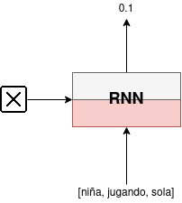
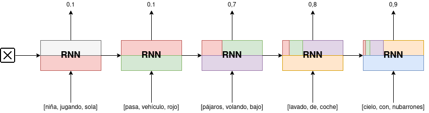
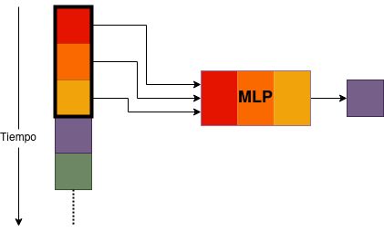
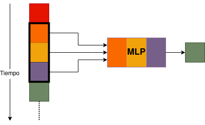
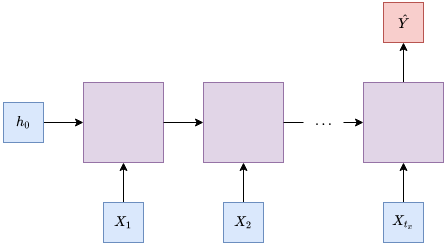
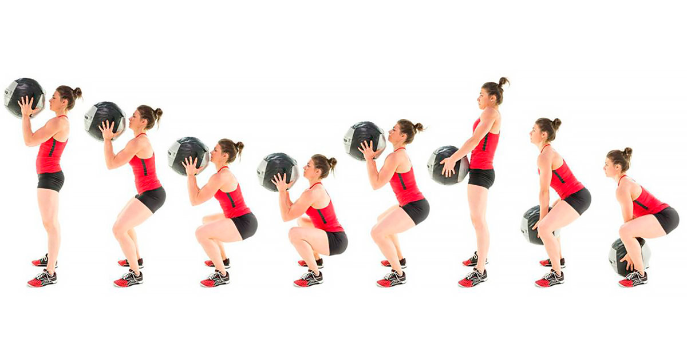
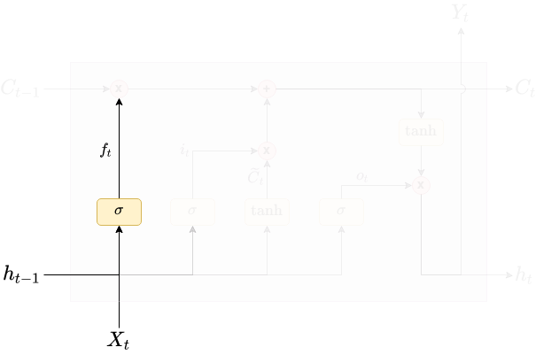
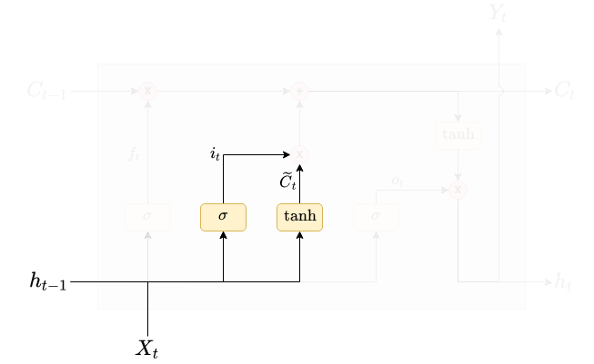
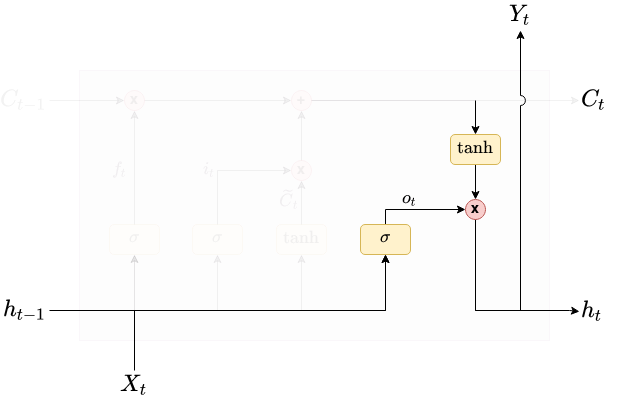
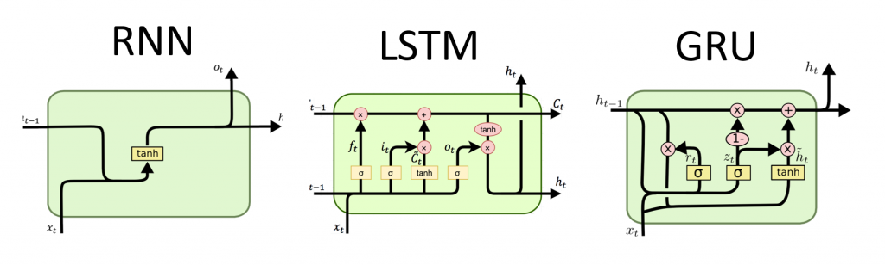

<!-- _class: titlepage -->

# Redes neuronales recurrentes

## Aprendizaje profundo

### Departamento de Sistemas Informáticos

#### E.T.S.I. de Sistemas Informáticos - UPM

##### 7 de marzo de 2024

[](https://creativecommons.org/licenses/by-nc-sa/4.0/)

---

En este tema hablaremos de redes neuronales recurrentes (RNN)

- Permiten tratar con información secuencial, pero no se limitan al análisis
- También pueden generar datos a partir de una o más entradas

Aprenderemos qué posibilidades nos ofrecen estos modelos y sus limitaciones

- Y técnicas para superar (casi mejor «mitigar») estas limitaciones

Las RNN tienen muchas aplicaciones prácticas en el mundo real

- Sobre todo en el procesamiento de lenguaje natural (NLP)
- De hecho ambas áreas (RNN y NLP) han evolucionado a la par en los últimos años

---

Series temporales<!-- _class: section -->

---

# ¿Qué es una serie temporal?

Es una **secuencia de observaciones** de una variable medida en el tiempo

- O dicho de otra forma, una **secuencia ordenada de datos**
- Los **datos consecutivos** tienen una **fuerte correlación** entre si
- Estos datos pueden ser tanto **numéricos** como **simbólicos**

Las series temporales se clasifican en:

- **Univariantes**: Secuencias de valores simples
  - P.ej. temperatura, precio de una acción, número de conexiones, etc.
- **Multivariantes**: Secuencias de valores de múltiples variables
  - P.ej. acelerómetros, canciones (sus múltiples pistas por instrumento), etc.
  - Se suelen representar descomponiéndolas en series univariantes

---

# ¿Por qué son importantes?

La información suele llegar como secuencia, no como muestras aisladas

- Los datos están intrínsecamente ligados a la noción de tiempo

Los humanos procesamos la información de esta manera $\rightarrow$ **Memoria secuencial**

- _Mecanismo del cerebro que facilita el reconocimiento de patrones secuenciales_
  1. Recita el alfabeto: _ABCDEFGHIJKLMNÑOPQRSTUVWXYZ_
     - Es fácil porque lo hemos aprendido así desde pequeños
  2. Ahora al revés: _ZYXWVUTSRQPOÑNMLKJIHGFEDCBA_
     - Es muy difícil, a no ser que lo hayamos practicado mucho anteriormente
  3. Ahora empieza a recitar el alfabeto desde la letra F
     - Al comienzo suele costar un poco (hay que localizar el comienzo del patrón)
     - El resto, una vez reconocido el patrón, sale de forma natural

---

# Problemas que involucran series temporales

- **Predicción**: Predecir el valor futuro de una variable en base a su pasado
  - P.ej. pronóstico del tiempo, predicción de ventas, etc.
- **Detección de anomalías**: Detectar valores atípicos en una serie de eventos
  - P.ej. detección de fraudes, detección de intrusos, etc.
- **Reconomiento de patrones**: Extraer patrones recurrentes de una serie de eventos
  - P.ej. detección de tendencias, detección de patrones de comportamiento, etc.

---

# Una advertencia

Cuidado con la **información futura en las características de entrada**

- Es un problema mucho más común de lo que puede parecer

En resumen, ocurre cuando entrenamos un modelo con datos pasados y datos _futuros_

- Especialmente cuando vamos a realizar un test del modelo
- Si separamos la serie en entrenamiento y test:
  - No basta con realizar una separación aleatoria de los ejemplos
  - Hay que separar los datos por tiempo: entrenamiento **ANTES** que test
  - Si no, estamos entrenando con información futura (**mal**)
- Insistimos: **Cuidado con añadir información futura en las entradas**

---

# Ventanas móviles (I)

Los problemas de predicción se basan en la idea de predecir el futuro dados:

1. El valor actual de la secuencia
2. El conocimiento almacenado en su estado interno

Podemos estimar este conocimiento como el histórico de los valores previos:

1. Tomamos una ventana de tamaño fijo en la secuencia
2. Utilizamos los datos de la ventana para predecir valores futuros de la secuencia
3. Deslizamos la ventana hacia adelante (p.ej. la mitad del tamaño de la ventana)
4. Volvemos al paso 2.

También se conocen como _sliding windows_ o _rolling windows_

---

# Ventanas móviles (II)

<figure>


<figcaption>

_**Figura 1**. Ejemplo de ventana móvil. Fuente: [Google Cloud Blog](https://cloud.google.com/blog/products/ai-machine-learning/how-to-quickly-solve-machine-learning-forecasting-problems-using-pandas-and-bigquery)_

</figcaption>
</figure>

---

# Ventanas móviles (III)

Este enfoque se usa en muchas aplicacinoes con éxito

- De hecho es el enfoque más simple y usado en series temporales
- En aprendizaje automático clásico se suele utilizar para mejorar las predicciones
- En el caso concreto del aprendizaje profundo hay dos aproximaciones:
  1. Alimentar la ventana entera a la red neuronal
     - Típico en perceptrones multicapa y también en redes convolucionales
  2. Alimentar los valores uno a uno e ir manteniendo una memoria
     - ¿Cómo que memoria? Sin estrés, en unos moomentos lo vemos
  
---

Redes neuronales recurrentes<!-- _class: section -->

---

# Intuición

_Una decisión **ahora** no se basa solo en lo que he percibido **ahora**_

Razonamos usando información previa, pero las redes _feed-forward_:

- <i>No</i> pueden manejar información de <i>entrada secuencial variable</i>
- En la salida <i>solo</i> se puede usar la <i>información de la entrada actual</i>
- <i>No</i> pueden <i>memorizar entradas pasadas</i> para predicciones

Una red recurrente añade **retroalimentación** a una **red neuronal**

- Aprovechan la naturaleza secuencial de los datos para predecir
- Cada salida depende implícitamente de todas las anteriores
- Mantienen un conocimiento histórico gracias a su memoria interna

---

# ¿Qué son las redes neuronales recurrentes?

Son redes neuronales que reutilizan _salidas_ anteriores como _parte de su entrada_

- Fueron introducidas durante la década de los 80<sup>1</sup>
  - Fueron poco populares en la época por sus requisitos funcionales para entrenar

Su propia salida es parte de la entrada en la siguiente predicción

- Esto permite que la red recuerde información de entradas anteriores
- Mantienen un estado interno (memoria) que se actualiza en cada paso de tiempo
- Son muy útiles cuando el contexto es fundamental

> <sup>1</sup> Concretamente con los trabajos de las redes de Hopfield (<i>[Neural networks and physical systems with emergent collective computational abilities.](https://www.pnas.org/doi/10.1073/pnas.79.8.2554)</i>) y de Elman (<i>[Finding structure in time](https://www.sciencedirect.com/science/article/abs/pii/036402139090002E)</i>).

---

# Intuición del funcionamiento de una RNN (I)

Supongamos que queremos predecir si va a llover a partir de observaciones

- Sin entrar en detalles, todo conceptual

<figure>


<figcaption>

_**Figura 2**. Predecimos el tiempo mediante un clasificador que se alimenta con conceptos._

</figcaption>
</figure>

La naturaleza secuencia de la red implica varios tipos de problemas

- Puede haber una o varias entradas y una o varias salidas
- Lo veremos más adelante explorando los diferentes tipos de problemas en RNN

---

# Intuición del funcionamiento de una RNN (II)

Observación en $t$: `(niña, jugando, sola)`

- No hemos observado nada previamente y el concepto no indica si va a llover o no
- Sin embargo, **la memoria interna tiene ahora una representación de la entrada**

<figure>


<figcaption>

_**Figura 3**. En el primer instante de tiempo sólo contamos con la información que acabamos de observar._

</figcaption>
</figure>

---

# Intuición del funcionamiento de una RNN (III)

Observación en $t+1$: `(pasa, vehículo, rojo)`

- La predicción no cambia en absoluto
- Sin embargo, _la memoria va **manteniendo conocimiento** de cada concepto pasados_

<figure>


<figcaption>

_**Figura 4**. El segundo instante de tiempo posee conocimiento en memoria y en entrada inmediata._

</figcaption>
</figure>

---

# Intuición del funcionamiento de una RNN (IV)

Observación en $t+2$: `(pájaros, volando, bajo)`

- La nueva observación aumenta la probabilidad a 0,7
- La memoria mantiene información acerca de las dos observaciones previas

<figure>


<figcaption>

_**Figura 5**. La memoria sigue almacenando conocimiento pasado según va llegando información nueva._

</figcaption>
</figure>

---

# Intuición del funcionamiento de una RNN (V)

Observación en $t+3$: `(lavado, de, coche)`

- La red entiende que los últimos dos conceptos aumentan la probabilidad de lluvia
- Se sigue manteniendo el conocimiento de conceptos anteriores
  - Lo malo es que la representación de los primeros se va diluyendo rápidamente

<figure>


<figcaption>

_**Figura 6**. El conocimiento pasado se mantiene, pero el más antiguo va disminuyendo en favor del nuevo._

</figcaption>
</figure>

---

# Intuición del funcionamiento de una RNN (VI)

Observación en $t+4$: `(cielo, con, nubarrones)`

Ha aumentado al predicción mucho

- Los conceptos anteriores "se recuerdan" y afectan a la inferencia
- Eso sí, los primeros solo la aumentan marginalmente

<figure>


<figcaption>

_**Figura 6**. La predicción sigue usando conocimiento de la primera, aunque en mucha menor medida._

</figcaption>
</figure>

---

# Intuición del funcionamiento de una RNN (VII)

El ejemplo ilustra cómo la red almacena la información

- Se mantiene la información de la salida anterior

Sin embargo, se intuye un problema de esta memoria

- La información anterior almacenada tiende a 0 en pocos pasos
- Ideal → Que la neurona decida qué recordar y qué olvidar
  - Bueno, lo hace (pesos de la retroalimentación) pero no es eficiente
  - Spoiler alert: Veremos una mejora más adelante

---

# La unidad recurrente simple (SRU) (I)

Recurrencia $\rightarrow$ Dependencia del valor actual con los valores anteriores

$$
y_t = f(x_t, y_{t-1})
$$

Las SRU son equivalentes a las neuronas en redes neuronales simples

- De hecho son muy parecidas a las neuronas de una red feed-forward
- Únicamente tienen una retroalimentación de la salida
- Una red neuronal recurrente es una combinación de una o más SRU
  - Sus arquitecturas varían con los tipos de problemas que se quieren resolver

---

# La unidad recurrente simple (SRU) (II)

Existen dos formas de representar una SRU

<figure>


<figcaption>

_**Figura 7**. Las dos representaciones típicas de una SRU, compacta (izquierda) y desplegada o _unrolled_ (derecha)._

</figcaption>
</figure>

Ambas son equivalentes, se usan indistintamente

- Generalmente se prefiere usar la _unrolled_ para facilitar la comprensión

---

# La "unidad recurrente simple" (SRU) (y III)

Ecuación muy parecidaa a un MLP:

<div class="columns">
<div class="column">

<figure>


<figcaption>

_**Figura 8**. Representación compacta de una SRU._

</figcaption>
</figure>

</div>
<div class="column">

$$
Y_t = f(W_XX_t ^\frown W_HH_{t-1}) = H_t
$$

Siendo:

- $X_t$ e $Y_t$: Entrada y salida de la SRU
- $f$: Activación (ReLU, tanh, sigm, ...)

Si pensamos en $H_{t-1}$ como memoria

- $W_H \rightarrow$ ¿Qué recuerdos considerar?

</div>
</div>

¿Y cómo aprenden? $\rightarrow$ **Backpropagation through time (BPTT)**<sup>2</sup>

> <sup>2</sup> No entramos en la implementación porque es compleja y no aporta
  nada al curso. Dos recursos interesantes del concepto los podemos encontrar en
  la entrada de la Wikipedia y el post [<i>A Gentle Introduction to
  Backpropagation Through Time</i>](https://machinelearningmastery.com/gentle-introduction-backpropagation-time/) de Jason Brownlee.

---

# Un detalle al que prestar atención

Hemos visto que el valor de salida en $t$ se obtiene con la siguiente fórmula:

$$
H_t = f(W_XX_t ^\frown W_HH_{t-1})
$$

Fijémonos en que:

- Sólo intervienen dos pesos:
  - $W_X$ que afecta a la entrada actual y $W_H$ que afecta al valor anterior de la salida $h_{t-1}$
- Los pesos **no** dependen del tiempo
  - $W_X$ (¿A qué debo prestar atención ahora?) y $W_H$ (¿Qué debo recordar de lo que pasó?)

Pero las RNN sólo funcionan bien para la memoria a corto plazo

- Sobre todo si están basadas en unidades unidades recurrentes simples

---

# Oye, pero he leído por ahí que ...

... está demostrado que un MLP es capaz de representar cualquier función

Sí, pero terminaríamos con _muchos parámetros_ y _ninguna estructura_

- Las RNN **aprovechan la estructura secuencial de los datos** en su arquitectura
- Es la misma historia que al comparar un MLP con una CNN
  - La CNN tiene una estructura interna que aprovecha la estructura espacial de los datos
- Al final utilizamos una fracción de los pesos de una forma más inteligente

También está el problema del tamaño de entrada constante

- Las redes <i>feed-forward</i> **deben tener un tamaño de entrada constante**
- En el mundo real tanto imágenes como secuencias tienen distintos tamaños

---

# Pero entonces un MLP normal vale, ¿no?

¡Por supuesto! Para eso están las _sliding windows_

<figure>
<div class="columns">
<div class="column">



</div>
<div class="column">



</div>
</div>

<figcaption>

_**Figura 9**. Al conjunto de datos se le llama overlapping windows dataset._

</figcaption>
</figure>

Lo malo es que tienen ciertos inconvenientes

- Requieren un tamaño de entrada y salida fijos (o reentrenar)
- En realidad no hay memoria, solo lo que hay en la ventana

---

# Además, echando cuentas ...

Supongamos un problema de clasificación de secuencias con:

- ... una longitud de secuencia de $T=20$, ...
- ... una entrada de dimensión $D = 30$, ...
- ... una capa oculta de tamaño $M = 16$, ...
- ... y $k = 3$ clases de salida

<div class="columns">
<div class="column">
<center>
En un MLP

$$
\begin{align}
I \rightarrow H &: & T \times D \times M &= 9600 \\
H \rightarrow O & : & M \times k &= 48 \\
\end{align}
$$

Total: _9648_ parámetros a ajustar
</center>
</div>
<div class="column">
<center>
En una RNN

$$
\begin{align}
I \rightarrow H &: & (D + M) \times M &= 736 \\
H \rightarrow O & : & M \times k &= 48 \\
\end{align}
$$

Total: _784_ parámetros a ajustar
</center>
</div>
</div>

---

Implementando redes recurrentes<!-- _class: section -->

---

# Conceptos generales: <i>Stacked</i> RNN

Apilar una SRU sobre otra nos lleva al concepto de RNN profundas (DRNN)

- Le damos los valores de entrada a la primera unidad ...
- ... la salida de la primera a la segunda ...
- ... y así sucesivamente ...

$$
\begin{align}
  H_t^1 &= f(W_X^1 X_t + W_H^1 H_{t-1}^1)\\
  H_t^2 &= f(W_i^2 H_{t-1}^1 + W_H^2 H_{t-1}^2)\\
  \ldots \nonumber\\
  H_t^n &= f(W_i^n H_{t-(n-1)}^{n-1} + W_H^n H_{t-(n-1)}^n)
\end{align}
$$    

En realidad es prácticamente lo mismo que añadir capas en un MLP

---

# Ventajas e inconvenientes de estas arquitecturas

<div class="columns">
<div class="column">

<center>

## Ventajas
</center>

- Posibilidad de procesar entradas de longitud variable
- El tamaño del modelo no crece con el tamaño de la entrada
- La inferencia tiene en cuenta la información histórica
- Los pesos se comparten a lo largo del tiempo

</div>
<div class="column">

<center>

## Inconvenientes
</center>

- procesamiento es mucho más lento
- Es difícil acceder a información lejana

</div>
</div>

---

# Implementación en keras (I)

Normalmente una capa produce una única salida:

```python
o = Dense(128)(i)
```

En unidades recurrentes podemos devolver el estado oculto:

```python
o, h = SimpleRNN(128, return_state=True)(i)
o, h = GRU(128, return_state=True)(i)
o, h, c = LSTM(128, return_state=True)(i)
```

_La diferencia de `o` y `h` es... ¡ninguna!_, así que ¿por qué preocuparnos en devolverlas?

- `return_sequences = True`: `o` pasa a ser una secuencia:

```python
o, h = SimpleRNN(128, return_sequence=True)(i)
```

---

# Implementación en keras (y II)

Hay tres capas RNN integradas en Keras:

- `keras.layers.SimpleRNN`: SRU donde la salida en $t-1$ se usa de entrada en $t$
- `keras.layers.LSTM` , Propuesta por Hochreiter y Schmidhuber<sup>3</sup> en 1997
- `keras.layers.GRU`: Propuesta por primera vez por Cho et al.<sup>4</sup> en 2014.

La primeras implementaciones de código abierto de LSTM y GRU fueron en 2015

> <sup>3</sup> Artículo: [<i>Long short-term memory</i>](https://ieeexplore.ieee.org/abstract/document/6795963)  
> <sup>4</sup> Artículo: [<i>Learning phrase representations using RNN encoder-decoder for statistical machine translation</i>](https://arxiv.org/abs/1406.1078)

---

# Implementación de RNN con Modelo Secuencial

Ejemplo de implementación de un modelo simple de RNN

```python
model = keras.Sequential()
model.add(layers.Embedding(input_dim=1000, output_dim=64))

# La salida de GRU será un tensor 3D de dimensión (batch_size, timesteps, 256)
model.add(layers.SimpleRNN(256, return_sequences=True))

# La salida de SimpleRNN será un tensor 2D de dimensión (batch_size, 128)
model.add(layers.SimpleRNN(128))

model.add(layers.Dense(10))

model.summary()   
```

---

# Un apunte las limitaciones de Keras

En Keras las SRU **usan secuencias de longitud fija** $N \times T \times D$

- Esto es, $N$ ejemplos de longitud $T$, con dimensión de entrada $D$
- El código resultante es más sencillo y más rápido (operaciones en batch)
  - Se pueden almacenar en matrices de NumPy o en tensores
  - ¡Un $T$ variable implica tener que hacer un bucle sobre todo!

Lo malo es que _tenemos que elegir la longitud de secuencia $T$_

- No caer en la trampa de escoger la más larga:
  - Las secuencias más cortas se rellenarán con ceros
  - Las más largas se truncarán (e.g. conjunto de test)
  - _Son muy raras_<sup>5</sup> (derroche de espacio y de tiempo)

> <sup>5</sup> [La larga estela](https://es.wikipedia.org/wiki/Larga_cola).

---

Arquitecturas de redes recurrentes<!-- _class: section -->

---

# Sobre los difentes tipos de problema

Las redes <i>feed-forward</i> tienen siempre la misma estructura

- Se presenta **un input**, se obtiene **un output**
- Prácticamente todos los problemas vistos hasta ahora son así
  - P.ej. MNIST: imagen de entrada $\rightarrow$ un único dígito de salida
- Se conoce como <i>**one-to-one**</i>

Ahora tenemos potencialmente **entradas y salidas como secuencias**

- **Entrada única, secuencia de salida**: P.ej. Subtitulado de imágenes
- **Secuencia de entrada, única salida**: P.ej. Clasificación de malware
- **Secuencia de entrada, secuencia de salida**: P.ej. Traducción automática o <i>name entity recognition</i>
  
_Utilizaremos la notación $T_x$ y $T_y$ para la longitud de entrada y salida_

---

# Arquitectura <i>**one-to-many**</i> ($T_x = 1, T_y > 1$)

**Generación de secuencias** a partir de una única entrada

- Aplicaciones: generación de texto, de tráfico de red, etiquetado de imágenes, ...

<figure>


<figcaption>

_**Figura 10**. Ilustración de la arquitectura one-to-many._

</figcaption>
</figure>

---

# Arquitectura <i>**many-to-one**</i> ($T_x > 1, T_y = 1$)

**Una única respuesta** para una secuencia de entrada (típico para clasificación)

Ejemplo - Análisis de malware de $2 KiB$: In: $X_1, \ldots, X_{2048}$, Out: $Y_1, \ldots, Y_{2048}$

- Qué $Y_i$ cogemos? Tiene sentido el último, ya que así ha visto todo el ejecutable
- Keras $\rightarrow$ `return_sequences=False` para devolver la última salida

<figure>


<figcaption>

_**Figura 11**. Ilustración de la arquitectura many-to-one._

</figcaption>
</figure>

---

# Arquitectura <i>**many-to-one**</i> - Otra vuelta de tuerca

¿Por qué coger el último estado? ¡podríamos estar perdiendo información clave!

<figure>


<figcaption>

_**Figura 12**. Ilustración de la arquitectura many-to-one usando max pooling para determinar la salida._

</figcaption>
</figure>

---

# Arquitectura <i>**many-to-many**</i> ($T_x = T_y$)

**Dos secuencias** de entrada y salida, ambas **del mismo tamaño**

- Típicas de problemas de etiquetado gramatical y similares

<figure>


<figcaption>

_**Figura 13**. Ilustración de la arquitectura many-to-many con el mismo tamaño de entrada-salida._

</figcaption>
</figure>

---

# Arquitectura <i>**many-to-many**</i> ($T_x \neq T_y$)

**Secuencia de entrada** que genera una de **salida** de, generalmente, **distinto tamaño**

- Típicas de problemas de traducción automática

<figure>


<figcaption>

_**Figura 14**. Ilustración de la arquitectura many-to-many con (potencial de tener) diferente tamaño de entrada-salida._

</figcaption>
</figure>

---

# Tipos de arquitecturas de redes neuronales

<figure>


<figcaption>

_**Figura 15**. Diferentes problemas en redes neuronales recurrentes. Autor: Andrej Karpathy<sup>6</sup>._

</figcaption>
</figure>

> <sup>6</sup> Extraído de la entrada del blog del autor [<i>The Unreasonable Effectiveness of Recurrent Neural Networks</i>](https://karpathy.github.io/2015/05/21/rnn-effectiveness/).

---

# ¿Se diferencian las RNN de las CNN? (I)

Ambas han impulsado el rendimiento de la inteligencia artificial en los últimos años

Las redes convolucionales son redes de tipo <i>**feed-forward**</i>

- Utilizan capas de filtros y de <i>pooling</i>
- Los tamañas de entrada y salida son fijos
- Se utilizan habitualmente sobre datos espaciales (p.ej. imagenes)

Por otro lado, redes recurrentes **retroalimentan** los resultados a la red

- Son adecuadas para datos secuenciales (p.ej. texto o vídeo)
- El tamaño de la entrada y la salida resultante pueden variar
- Sus casos de uso incluyen el procesamiento del lenguaje natural, la detección de anomalías o la generación de secuencias

---

# ¿Se diferencian las RNN de las CNN? (II)

¿Qué pasa si queremos entender qué ocurre en las imágenes?

<figure>


<figcaption>

_**Figura 16**. ¿Hacia dónde se mueven la cabeza y la pelota?._

</figcaption>
</figure>

La secuencia de imágenes pasada le da contexto a la predicción

---

# ¿Se diferencian las RNN de las CNN? (III)

<figure>


<figcaption>

_**Figura 16**.Los eventos pasados añaden información y contexto._

</figcaption>
</figure>

Las RNN están diseñadas precisamente para recordar la información previa

---

# ¿Se diferencian las RNN de las CNN? (y IV)

Hemos aprendido que las redes recurrentes tienen en cuenta píxeles adyacentes

- ¿Y el mismo mecanismo para eventos adyacentes en el tiempo?
  - No es que no funcione, de hecho se usa bastante
  - De hecho es una muy buena forma de arrancar una prueba de concepto
    - Las interfaces en Keras son prácticamente iguales
  - Es un enfoque innecesariamente indirecto
    - Es usar un modelado espacial para captar un fenómeno temporal
    - Requiere mucho más esfuerzo y memoria para realizar la misma tarea

Ambas técnicas se complementan $\rightarrow$ Redes de convolución recurrentes (CRNN):

- Etiquetado de vídeos, reconocimiento de gestos, _sentiment analysis_ en lenguas [logográficas](https://es.wikipedia.org/wiki/Logograma), ...

---

# Sobre las dependencias a largo plazo

Supongamos la frase _«Las **nubes** están en el ...»_

- La respuesta más obvia sería **cielo**
- Casi no necesitamos más contexto que la palabra **nubes**

Ahora supongamos la frase: _«He residido en <strong>España</strong> los últimos 10 años, durante los cuales he visitado gran parte del país y disfrutado de su gastronomía. Puedo hablar con bastante fluidez el ...»_

- La información relevante de la respuesta **español**, pero la información relevante está muy lejos para poder predecir

Las arquitecturas LSTM y GRU nos ayudan a _**mitigar**_ este problema

- Implementan técnicas para aprender **qué** elementos **retener** y **cuáles olvidar**

---

Unidades Long Short-Term Memory<!-- _class: section -->

---

# Long Short-Term Memory (LSTM)

Son un tipo especial de SRU capaz de aprender dependencias a largo plazo

- Diseñadas **expresamente** para el problema de las dependencias
- Tratan de entender *qué datos deberían ser recordados* y _qué datos pueden olvidarse_

Son un **recambio directo de las SRU**

<figure>


<figcaption>

_**Figura 18**.Esquema de la arquitectura de una unidad LSTM._

</figcaption>
</figure>

---

# El estado de la unidad LSTM

La clave de las LSTM es la línea horizontal superior

- Es el **estado de la unidad** y la información fluye por ella, generalmente sin cambios

La unidad tiene la **capacidad de añadir o quitar información** al estado

- Esto se gestiona a través de las estructuras denominadas _puertas_
- Son una forma de dejar (o no) pasar información
- Están compuestas por unos pesos, una activación $\sigma$ y un producto punto a punto
  - La activación determina la cantidad de cada componente que "pasa"
  - Va de $0$ (no pasa nada) a $1$ (pasa totalmente)

---

# 1. ¿Qué información descartamos?

Comprueba $h_{t-1}$ y $X_t$ y devuelve  $f_t \in (0, 1)$ para cada componente de $C_{t-1}$

- De $0$ (olvidar completamente) a $1$ (recordar completamente)

<div class="columns">
<div class="column">

##### _Forget gate layer_

<figure>


<figcaption>

_**Figura 18**. Forget gate._

</figcaption>
</figure>

</div>
<div class="column">

##### Ejemplo

El estado mantiene el género:

- Así usa los pronombres correctos
- Si viene un nuevo sujeto, probablemente querremos olvidar el anterior

$$
f_t = \sigma(W_f [h_{t-1, X_t}] + b_f)
$$

</div>
</div>

---

# 2. ¿A qué información prestamos atención?

Comprueba $h_{t-1}$ y $X_t$ y devuelve:

- Valores que vamos a actualizar (\textit{input gate layer)}
- Valores candidatos que \textit{podrían} se añadidos al estado

<div class="columns">
<div class="column">

##### _Input gate layer_

<figure>


<figcaption>

_**Figura 19**. Input gate._

</figcaption>
</figure>

</div>
<div class="column">

##### Sobre el ejemplo anterior

- Se actualizaría la información del género
- Se añadiría información si fuese necesario

$$
\begin{align}
  i_t &= \sigma(W_i [h_{t-1, X_t}] + b_i)\\
  \widetilde{C}_t &= \tanh(W_C [h_{t-1, X_t}] + b_C)
\end{align}
$$

</div>
</div>

---

# 3. Actualización del estado

Se actualiza el estado $C_{t-1}$ con la nueva información

- En los anteriores pasos **se decide** qué hacer con las entradas
- **Ahora** únicamente tenemos que **hacerlo**

<div class="columns">
<div class="column">

##### _Actualización del estado_

<figure>


<figcaption>

_**Figura 20**. Actualización del estado._

</figcaption>
</figure>

</div>
<div class="column">

##### Sobre el ejemplo anterior

- Aquí se eliminaría la información sobre el género del antiguo sujeto

$$
C_t = f_t \odot C_{t-1} + i_t \odot \widetilde{C}_t
$$

</div>
</div>

Este nuevo estado se le pasará a la neurona en la siguiente iteración

---

# 4. ¿Qué información damos de salida?

Decidimos la salida (filtrando el estado que estamos pasando):

- Capa sigmoide que decide qué partes del estado sacar
- Tangente del estado para transformar al intervalo $(-1, 1)$
- Producto de ambas para sólo sacar las partes decididas

<div class="columns">
<div class="column">

##### _Decisión de salida_

<figure>


<figcaption>

_**Figura 21**. Decisión de salida._

</figcaption>
</figure>

</div>
<div class="column">

##### Sobre el ejemplo anterior

- Da información relevante a:
  - ... género para construir un adjetivo
  - ... número para conjugar un verbo

$$
\begin{align}
  o_t &= \sigma(W_o [h_{t-1, X_t}] + b_o)\\
  h_t &= o_t \odot \tanh(C_t)
\end{align}
$$

</div>
</div>

---

Unidades Gated Recurrent Unit<!-- _class: section -->

---

# Unidades <i>Gated Recurrent Unit</i> (GRU) (I)

Se pueden considerar como una **versión simplificada de las** unidades **LSTM**

- Mismo objetivo que las LSTM $\rightarrow$ mitigar el problema de la memoria a largo plazo

Su rendimiento es muy similar al de las LSTM

- Empíricamente parece que GRU se comporta mejor con _datasets_ pequeños
- Sin embargo, algunos autores recomiendan combinar ambas:
  - Capacidad de aprender asociaciones a largo plazo para la LSTM
  - Capacidad de aprender de patrones a corto plazo para la GRU
- ¿Cuál usar? $\rightarrow$ **Ensayo y error**

---

# Unidades <i>Gated Recurrent Unit</i> (GRU) (y II)

<div class="columns">
<div class="column">

##### _Unidad recurrente GRU_

<figure>


<figcaption>

_**Figura 22**. Esquema de unidad GRU._

</figcaption>
</figure>

</div>
<div class="column">

##### Características

1. No existe entrada de estado
2. Dos puertas para gestionar entradas
   1. Salida anterior y entrada actual
   2. Salida anterior y actual

$$
\begin{align}
  z_t &= \sigma(W_z[h_{t-1, X_t}] + b_z)\\
  r_t &= \sigma(W_r[h_{t-1, X_t}] + b_r)\\
  \widetilde{h_t} &= \tanh(W_h [r_t \odot h_{t-1}, x_t])\\
  h_t &= (1 - z_t) \odot h_{t-1} + z_t \odot \widetilde{h_t}
\end{align}
$$

</div>
</div>

---

# Resumen de unidades recurrentes

<figure>


<figcaption>

_**Figura 22**. Comparativa de los diferentes modelos de redes recurrentes._

</figcaption>
</figure>

---

# Licencia<!--_class: license -->

Esta obra está licenciada bajo una licencia [Creative Commons
Atribución-NoComercial-CompartirIgual 4.0
Internacional](https://creativecommons.org/licenses/by-nc-sa/4.0/).

Puede encontrar su código en el siguiente enlace:
<https://github.com/etsisi/Aprendizaje-profundo>
