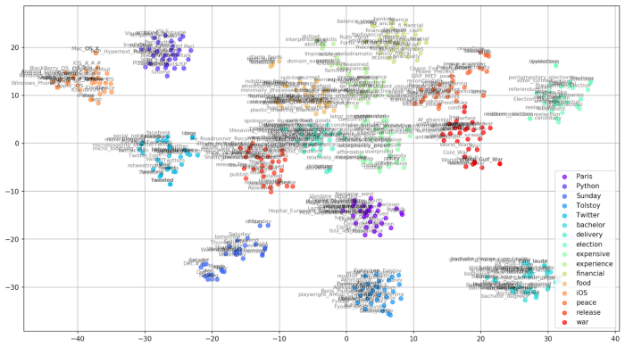
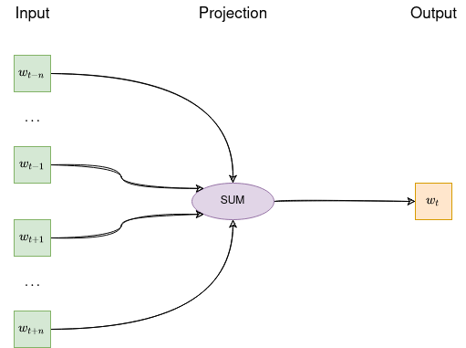
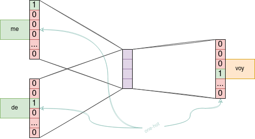
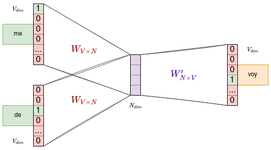
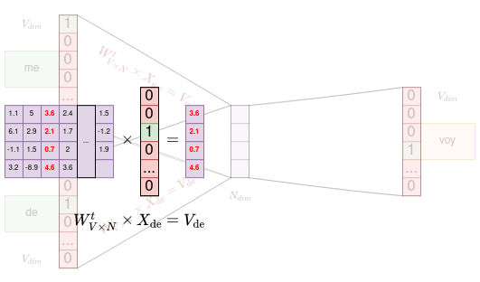
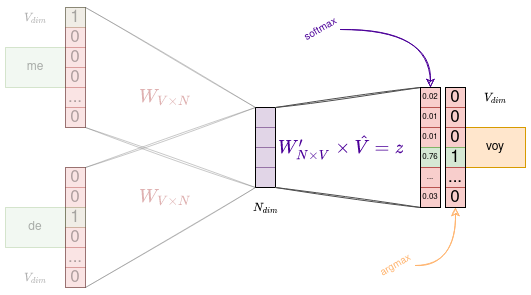
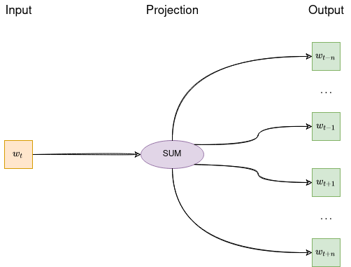
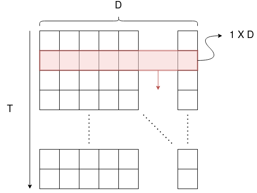
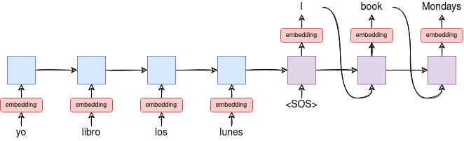
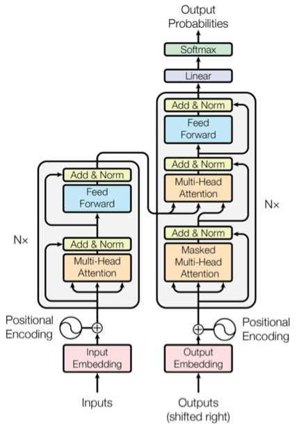

<!-- _class: titlepage -->

# Procesamiento del lenguaje natural

## Aprendizaje profundo

### Departamento de Sistemas Informáticos

#### E.T.S.I. de Sistemas Informáticos - UPM

##### 8 de marzo de 2024

---

El lenguaje natural es considerado un rasgo distintivo de la inteligencia humana

- Se define como el lenguaje hablado y escrito que utilizamos a diario
- Es el mayor depósito de conocimiento humano que existe
- Permite la interacción hombre-máquina mediante sistemas que entienden el lenguaje

Abordaremos el NLP desde el punto de vista del aprendizaje profundo

- Veremos diferentes formas de representar el lenguaje y la solución más adoptada:
los <i>embeddings</i>
- También resolveremos problemas usando CNN y RNN

---

# Introducción<!-- _class: section -->

---

# ¿Qué es el procesamiento de lenguaje natural?

Área de la IA que cubre la **comprensión** y **generación** de lenguaje natural

- No está limitado únicamente al texto (p.ej. también hablado, lengua de signos, ...)
- Está mucho más avanzado en texto escrito (es del que hay más datos disponibles)
- También está relacionado con otros campos como la lingüística, la psicolingüística, las ciencias cognitivas y la estadística
- Uno de sus objetivos es conseguir que los ordenadores trbajen con nuestro lenguaje en lugar de trabajar nosotros con el suyo

Por cierto, la voz artificial suena cada vez más natural

- Con inflexiones tonales y prosódicas que imitan la humana (p.ej. [VALL-E](https://valle-demo.github.io/))

No pertenece únicamente al campo de la IA

---

# Áreas de trabajo en NLP

Podemos dividir el NLP en dos áreas de trabajo bien diferenciadas:

1. <i>Natural language generation</i> (NLG): Generación de lenguaje a partir de representaciones internas
   - Puede considerarse como un componente de traducción entre los datos y el lenguaje natural
   - Se subdivide en múltiples tareas: planificación del discurso, selección léxica, ...
2. <i>Natural language understanding</i> (NLU): Comprensión lectora de las máquinas
   - Transformar el lenguaje natural en una representación adecuada para la máquina
   - Normalmente, requiere diferentes niveles de análisis: morfológico, sintáctico, semántico, discurso, ...

El NLU es más complejo que NLG (aunque _**ambos problemas son muy difíciles**_)

> 1 Artículo: [<i>Logical syntax and semantics: Their linguistic relevance</i>](https://www.jstor.org/stable/410891?casa_token=HvgwCSUt7p8AAAAA%3A86XsVcuDQEfE0ByMoGa9ERrtVKWUzd-lkCpvGPa-9IBC6uRX4S75CaWkPBA-8vidCMxRWAa1Kq6tHMQ7JCQAJZnNPlqArpw2ZUkizRkB1Rx0J9FQow)
---

# Los dos enfoques principales en NLP

**Basados en gramáticas** o **modelos lógicos**: Enfoque <i>top-down</i>

- Diseñados para intentar reflejar la estructura lógica del lenguaje
- Surgen de las teorías lingüísticas de N. Chomsky a mediados de los 19501
- Desarrollar reglas de reconocimiento de patrones estructurales, utilizando un formalismo gramatical específico
- Los patrones de reconocimiento se definen por las reglas e información adicional

**Basados en datos**: Enfoque <i>bottom-up</i>

- Abarcan tanto modelos probabilísticos como basados en <i>machine learning</i>
- Se parte de ejemplos para calcular su probabilidad de aparición en un contexto
- Permiten predecir la siguiente unidad en un contexto determinado **sin reglas gramaticales explícitas**

---

# Ventajas y desventajas

##### Ventajas

- Un usuario podría **hacer preguntas en su idioma natal** en lugar de aprender una sintaxis de consulta específica
- La exactitud de las respuestas tiende a aumentar según aumenta la cantidad de información relevante en la pregunta
- Las respuestas se pueden ofrecer en el idioma del usuario

##### Desventajas

- El sistema puede no ser capaz de dar una respuesta correcta si la pregunta está mal formulada o es ambigua
- Los sistemas se construyen para una tarea única y específica
  - Son incapaces de adaptarse a nuevos problemas

---

# Ejemplos de aplicaciones<!-- _class: section -->

---

# Recordatorio de tipos de problema

<figure>

<figcaption>

_**Figura 1**. Diferentes problemas en redes neuronales recurrentes. Autor: Andrej Karpathy6._

</figcaption>
</figure>

> 6 Extraído de la entrada del blog del autor [<i>The Unreasonable Effectiveness of Recurrent Neural Networks</i>](https://karpathy.github.io/2015/05/21/rnn-effectiveness/).

---

# Aplicaciones <i>one-to-many</i>

En NLP no existen demasiadas aplicaciones one-to-many

- Después de todo, una parte del NLP es el NLU, que trabaja con secuencias de entrada

Las que existen suelen trabajar a partir de una semilla inicial para generar texto

- Etiquetado de vídeos
- Creación de pies de foto para imágenes

---

# Aplicaciones <i>many-to-one</i>

Tenemos, por ejemplo, los motores de búsqueda como Google, Yahoo o Bing

- El motor de búsqueda de Google incluso entiende tanto el texto como el contexto
  - La misma query para dos personas o momentos diferentes arroja resultados diferentes

Las redes sociales (p.ej. twitter) infieren a partir de los intereses de los usuarios

- También de los contenidos generados por los usuarios en forma de publicaciones (a ver si no por qué iban a haber pagado tanto por WhatsApp)

En general, soluciones para clasificar texto

- Filtros de spam2, procesamiento de historiales clínicos3, detección de paráfrasis, ...

> 2 Artículo: [<i>Deep learning to filter SMS Spam</i>](https://www.sciencedirect.com/science/article/pii/S0167739X19306879?casa_token=GIRf3Zf3s4UAAAAA:kkR8mI1vr-OT31kMVRvTLJXSkH6C91ZTBeIbJBxNBWDtn8cTVjwybdXaP_JNmz6FGscFdn80)  
> 3 Artículo: [<i> Natural Language Processing of Clinical Notes on Chronic Diseases: Systematic Review</i>](https://medinform.jmir.org/2019/2/e12239/)
---

# Aplicaciones <i>many-to-many</i>

Ejemplo típico $\rightarrow$ asistentes virtuales (p.ej. Siri de Apple o Alexa de Amazon)

- O implementaciones libres como <i>Open Assistant</i>4, <i>Mycroft AI</i>5 y <i>Dragonfire</i>6

Generación de información a partir de una secuencia de datos previa

- Desde sugerencias de continuación de una frase o incluso ¡juegos completos!7

Recordemos que las many-to-many también funcionan como $T_x = T_y$

- Etiquetado gramatical, corrección ortográfica8, ...

> 4 Proyecto: [<i>Open Assistant</i>](https://openassistant.org)  
> 5 Proyecto: [<i>Mycroft AI</i>](https://mycroft.ai)  
> 6 Proyecto: [<i>Dragonfire</i>](https://dragon.computer/)  
> 7 El juego [<i>AI Dungeon</i>](https://play.aidungeon.io) es una aventura conversacional totalmente generada por un modelo de lenguaje basado en un modelo propio de lenguaje (originalmente fue GPT-2)  
> 8 Artículo: [<i>Personalized spell checking using neural networks.</i>](https://d1wqtxts1xzle7.cloudfront.net/30705837/garaas_xiao_pomplun_HCII2007-libre.pdf?1391841084=&response-content-disposition=inline%3B+filename%3DPersonalized_Spell_Checking_using_Neural.pdf&Expires=1676766534&Signature=bwuOh8AgKTsngRHfOLKY3lUw3vdyjbKVLR5fLs9usZWTCh426GVRrhpeBJWjXdDYrDostORzmQfYGLyUK4Np71q8ZdjSYCgXUPe-1I~SfYMYtaWns5tOH7UZ02FAKuji2FmigbfLFQ24VEd-rufeCdAydjqVdkOX3nQNNCM5mLfIMxXOizPnuhsm9Qkn1EzSbXUIYcsaJgpVVLOn0lMWtPuMzMzhAoWgLxjHr1dVs1e97Vw1XyQTyAdyviJ98mgzAyCA0FKqn65~Xyl76mjUEr47uXCSrK4jA~Lxzu78Ta5r8LdO~wXWiZaFLlCcX5wCFE-CE~gIbeijpJMm6-vSQA__&Key-Pair-Id=APKAJLOHF5GGSLRBV4ZA)  

---

# Representación del lenguaje<!-- _class: section -->

---

# $n$-gramas

Si tenemos la grase «el deep learning es la leche» y cada _token_ es una palabra

- Modelo $1$-gramas (unigrama): convierte la frase en una secuencia de palabras
  - `{el, deep, learning, es, la, leche}`
- Modelo $2$-gramas (bigrama): convierte la frase en combinaciones de dos palabras
  - `{(el, deep), (deep, learning), (learning, es), (es, la), (la, leche)}`
- Modelo $3$-gramas (trigrama), $4$-gramas (tetragrama), $5$-gramas (pentagrama), ...

Desglosar un texto en $n$-gramas es un proceso muy usado en el NLP tradicional

- Esencial para mantener el recuento de conceptos en frases
- Constituye la columna vertebral de los procesos matemáticos tradicionales

---

# _Bag-of-Words_ (BoW)

Representación de un texto como el multiconjunto9 de sus palabras

La forma más común de representación es como formato tabular:

- **Fila**: Observación (p.ej. documento)
- **Columna**: Token (p.ej. $n$-grama, ...)
- **Celda**: El recuento del token en esa observación

| ID | Agua | Archaeopteryx | Zumo |
|----|------|---------------|------|
| 001 | 12 | 12 | 0 |
| 002 | 1 | 5 | ... |
| ... | ... | ... | ... |
| 999 | 35 | 0 | 13 |

Solo se trabaja con frecuencias ya que el resto de información se ha perdido

> 9 En el contexto de la informática, un multiconjunto (bolsa o _bag_) es un conjunto que puede contener elementos repetidos (<https://es.wikipedia.org/wiki/Multiconjunto>)

---

# PREPARÉMONOS PARA CONOCER LA VERDAD ABSOLUTA DEL NLP<!-- _class: accent -->

---

# LAS PALABRAS SON CADENAS DE TEXTO<!-- _class: accent -->

---

## ...<!-- _class: accent -->

---

## (¿y el problema?)<!-- _class: accent -->

---

# ¡EN APRENDIZAJE PROFUNDO SE TRABAJA CON NÚMEROS!<!-- _class: accent -->

---

# Codificación <i>one-hot</i><!-- _class: section -->

---

# Codificación _one-hot_

La codificación _one-hot_ transforma una variable categórica en una numérica

- Por ejemplo si nuestro idioma se compone de las palabras `quiero`, `comer` y `pizza`, podemos codificarlas como:
  - `[1, 0, 0]` $\rightarrow$ `quiero`
  - `[0, 1, 0]` $\rightarrow$ `comer`
  - `[0, 0, 1]` $\rightarrow$ `pizza`

Rápido, sencillo, claro, ¿por qué no es una buena idea para codificar palabras?

- No es capaz de almacenar información de las relaciones con otras palabras
  - e.g. `gato` y `perro` están igual de relacionados que `gato` y `corneta`
- El espacio que ocupa en memoria es sencillamente prohibitivo

---

# No lo imaginamos:<!-- _class: accent -->

## $\approx 10^5$ palabras $\implies$ $10^5 \times 10^5 = 10^{10}$ elementos (bits) $\approx 1,15$ GB

---

# Vectores de palabras (_word vectors_)

| | Género | Edad | Lugar |
|-|--------|------|-------|
| rey | +1 | +1 | 0 |
| reina | +1 | +1 | 0 |
| príncipe | +1 | +1 | 0 |
| princesa | +1 | +1 | 0 |
| manhattan | +1 | +1 | 0 |
| tomelloso | +1 | +1 | 0 |

- **Vectores de características** en NLP
- Más compactos que <i>one-hot</i>

<figure>

<figcaption>

_**Figura 2**. Visualización de clústers de palabras._

</figcaption>
</figure>

Las palabras son vectores: $V(rey) − V(hombre) \approx V(reina) − V(mujer)$

---

# ¿Qué características escoger para las palabras?

Muy difícil determinar las características relevantes para clasificar las palabras

- ¿Qué características son las que vamos a utilizar?
- ¿Es relevante el rasgo triste? ¿Cómo medimos la tristeza de una patata?
- ¿Vamos a estudiar cada palabra individualmente?
- ¿Cuántas palabras existen en una lengua?
- Necesitamos formas automatizadas de crear esos vectores de palabras

Las inferidas en aprendizaje no supervisado no tienen por qué tener sentido

- Mientras tengan sentido geométrico, dejemos que el algoritmo infiera las mejores
- Análogo a vectores latentes, como las capas internas de una red neuronal

---

# _Embeddings_

Un _embedding_ es simplemente una **matriz de vectores de palabras apiladas**

- A partir de 201311 se sentaron las bases de las técnicas actuales
- Algunos autores los denominan _word embedding_ o _word embedding matrix_

Convenio:

- $V \rightarrow$ Número de filas $=$ Tamaño del vocabulario $=$ Número de palabras distintas
- $D \rightarrow$ Dimensión del embedding $=$ Tamaño del vector de características

_Transfer learning_ $+$ _embeddings_ $=$ Pilar fundamental del NLP

- Veremos los dos métodos más conocidos: <i>Word2Vec</i> y <i>GLoVe</i>

> 11 Existen desde el 2001 ([<i>A neural probabilistic language model</i>](https://www.jmlr.org/papers/volume3/bengio03a/bengio03a.pdf)), pero el verdadero boom fue a partir del 2013 ([<i>Distributed representations of words and phrases and their compositionality</i>](https://proceedings.neurips.cc/paper/2013/file/9aa42b31882ec039965f3c4923ce901b-Paper.pdf)), momento en el que se mejoró su eficiencia de manera dramática.

---

# ¿Cómo se usan los <i>embeddings</i>?

Generalmente a través de <i>transfer learning</i>, lo cual es bueno porque:

- Hay gente/compañías con más recursos computacionales que nosotros
- Encontrar los mejores hiperparámetros es una tarea ardua (ensayo y error)
- Evitamos otros preprocesos sobre los datos (p.ej. mitigación del sesgo)

Truco computacional: Obtener el vector de palabra indexando, no multiplicando

- En Keras significa no usar una capa `Dense()`, sino las capas `Embedding()`

¿Y si el dataset tiene palabras que no existen en el <i>embedding</i> preentrenado?

- Abreviaturas, modismos, palabras mal escritas, palabras poco comunes, ...
- Los pesos pueden ser inicializados aleatoriamente o a 0

---

# ¿Deberíamos entrenar los embeddings?

`model.fit(X, Y)` **actualiza** automáticamente **todos los parámetros** del modelo

- ¿Entrenamos el <i>embedding</i>? La mayoría de las bibliotecas no son tan finas
  - Vamos, o lo entrenamos entero, o no lo entrenamos
- No olvidemos de que _las palabras poco comunes son_, por definición, _poco comunes_

Por lo general, no tenemos que molestarnos en hacer un <i>fine-tunning</i> del <i>embedding</i>

- Pero a veces es bueno experimentar con nuestros propios datos
- En Keras, si lo necesitamos, basta simplemente con cambiar el atributo `trainable`:
  - `embedding_layer.trainable = True` $\rightarrow$ <i>fine-tunning</i> (valor por defecto)
  - `embedding_layer.trainable = False` $\rightarrow$ Pesos constantes

---

# <!--fit-->[Creación y visualización de _embeddings_.ipynb](https://colab.research.google.com/github/etsisi/Aprendizaje-profundo/blob/main/Notebooks/Procesamiento%del%20lenguaje%20natural%20-%20Creación%20y%20visualización%20de%20embeddings.ipynb)<!--_class: accent-->

---

# _Word2vec_<!-- _class: section -->

---

# Introducción

_Word2vec_ es una de las técnicas existentes para representar texto como vectores

- Su eficacia reside en su capacidad para agrupar vectores de palabras similares
- Estima el significado de una palabra basándose en sus apariciones en el texto

Las operaciones algebraicas sobre los vectores permite jugar con sus significados

- $V(peral) − V(pera) + V(nuez) = V(nogal)$

Existen dos arquitecturas dependiendo de su cometido

- <i>Continous bag-of-words (CBoW)</i>: Predice una palabra según las circundantes
- <i>Skip-grams</i>: Predice las palabras circundantes en función de la central

---

# ¿Por qué es interesante?

Permite a las palabras **relacionarse en dimensiones aprendidas**

<figure>

<figcaption>

_**Figura 3**. Relaciones entre palabras aprendidas por Word2Vec._

</figcaption>
</figure>

- Surgieron muchos estudios para intentar aclarar estas relaciones lineales12
- Hubo estudios que demostraron que las relaciones no están exentas de sesgo13

> 12 Algunos de estos artículos: <i>[Evaluating the stability of embedding-based word similarities](https://direct.mit.edu/tacl/article/doi/10.1162/tacl_a_00008/43418/Evaluating-the-Stability-of-Embedding-based-Word)</i>, <i>[A latent variable model approach to pmi-based word embeddings](https://direct.mit.edu/tacl/article/doi/10.1162/tacl_a_00106/43373/A-Latent-Variable-Model-Approach-to-PMI-based-Word)</i>, <i>[The strange geometry of skip-gram with negative sampling](https://aclanthology.org/D17-1308/)</i> y <i>[Factors influencing the surprising instability of word embeddings](https://aclanthology.org/N18-1190/)</i>.  
> 13 Artículo <i>[Man is to computer programmer as woman is to homemaker? debiasing word embeddings](https://proceedings.neurips.cc/paper/2016/file/a486cd07e4ac3d270571622f4f316ec5-Paper.pdf)</i>.

---

# Arquitectura CBoW (I)

Idea: Tomar los $n$ vectores anteriores y posteriores del objetivo y sumarlos

<figure>

<figcaption>

_**Figura 4**. Esquema de arquitectura CBoW. La suma de los vectores es suficiente para deducir la palabra._

</figcaption>
</figure>

**Nota** $\rightarrow$ Al igual las _bag-of-words_, _las CBoW también eliminan el orden_

---

# Arquitectura CBoW (II)

Ejemplo de frase: «Hoy me _voy_ de parranda»; ventana: 5 palabras ($\pm$ 2 palabras)

<figure>

<figcaption>

_**Figura 5**. Entrenaremos el modelo indicando que debe de inferir `voy` a partir de `hoy`, `me`, `de` y `parranda`._

---

# Arquitectura CBoW (III)

Cada palabra (entrada y salida) se codifican mediante <i>one-hot</i>

<figure>

<figcaption>

_**Figura 6**. Codificación de cada palabra en one-hot. Se muestran únicamente dos palabras por motivos de espacio._

</figcaption>
</figure>

---

# Arquitectura CBoW (IV)

Nuestro objetivo es aprender dos matrices: $W_{V \times N}$ y $W'_{N \times V}$

<figure>

<figcaption>

_**Figura 7**. Matrices de transformacion de palabra a word vector ($W_{V \times N}$) y viceversa ($W'_{N \times V}$)._

</figcaption>
</figure>

$V$ Será el tamaño del vocabulario y $N$ la dimensión del vector de palabra

---

# Arquitectura CBoW (V)

El producto entre $W^t_{V \times N}$ y el <i>one hot</i> de una palabra nos da su vector

<figure>

<figcaption>

_**Figura 8**. Obtención del vector de características de una palabra a partir de su codificación one hot._

</figcaption>
</figure>

---

# Arquitectura CBoW (VI)

El producto entre el vector de una palabra y $W'_{N \times V}$ nos da un vector de dimensión $V$

- Este lo aproximamos al one hot más cercano, que será el de la palabra buscada

<figure>

<figcaption>

_**Figura 9**. Obtención de la palabra a partir de un determinado vector de características._

</figcaption>
</figure>

---

# Arquitectura CBoW (i VII)

Tras el entrenamiento podemos considerar la matriz $W_{V \times N}$ como el <i>embedding</i>

<figure>

<figcaption>

_**Figura 10**. Nuestro embedding resultante._

</figcaption>
</figure>

Hay que destacar que:

- La matriz $W'_{N \times V}$ puede servir también como capa de <i>embedding</i>
- De hecho, es bastante común usar ambas matrices como dicha capa

---

# Arquitectura _skip-grams_

Es la arquitectura inversa a la CBoW

- Intenta predecir la ventana de palabras circundantes a partir de la palabra actual

<figure>

<figcaption>

_**Figura 11**. Esquema de arquitectura skip-gram. Se deducen los vectores a partir de una determinada palabra._

</figcaption>
</figure>

Problema mucho menos concreto, pero empíricamente parece que escala mejor

---

# <!--fit-->[Implementación de _word2vec_ basado en _skip-grams_.ipynb](https://colab.research.google.com/github/etsisi/Aprendizaje-profundo/blob/main/Notebooks/Procesamiento%del%20lenguaje%20natural%20-%20Implementación%20de%20word2vec%20basado%20en%20skip-grams.ipynb)<!--_class: accent-->

---

# Más allá de Word2vec

Las relaciones obtenidas mediante _word2vec_ parecen totalmente intuitivas

- Luego se demostró que se podían obtener mediante factorización matricial14

A pesar de los avances, _word2vec_ sigue siendo muy utilizado en la actualidad

- Hay estudios que van desde el nivel "subpalabra"15 al de oración16
- Trasciende el NLP, aplicandose al dominios como los grafos17 o la biología18
- Proyectar <i>embeddings</i> de diferentes idiomas sobre el mismo espacio vectorial19

> 14 Artículo  [<i>Glove: Global vectors for word representation</i>](https://nlp.stanford.edu/pubs/glove.pdf).
> 15 Artículo: [<i>Bag of Tricks for Efficient Text Classification</i>](https://aclanthology.org/E17-2068/) (FastText).  
> 16 Artículos: [<i>Skip-thought vectors</i>](https://proceedings.neurips.cc/paper/2015/file/f442d33fa06832082290ad8544a8da27-Paper.pdf) y [<i>Distributed representations of sentences and documents</i>](https://dl.acm.org/doi/10.5555/3044805.3045025).  
> 17 Artículo: [<i>node2vec: Scalable Feature Learning for Networks</i>](https://arxiv.org/abs/1607.00653).  
> 18 Concretamente al estudio de las secuencias biológicas: [<i>Continuous distributed representation of biological sequences for deep proteomics and genomics</i>](https://journals.plos.org/plosone/article?id=10.1371/journal.pone.0141287).  
> 19 El objetivo es la transferencia multilingüe. Es un caso concreto [Zero-shot Learning (ZSL)](https://en.wikipedia.org/wiki/Zero-shot_learning), cuyo objetivo es conseguir un modelo útil a partir de pocos o ningún ejemplo etiquetado.

---

# <!--fit-->Global Vectors for Word Representation (GloVe)<!-- _class: section -->

---

# ¿Qué es GloVe?

Es una técnica para la obtención de vectores de palabras

- Al igual que word2vec, usa ventanas para obtener estadísticas locales
- Incorpora además estadísticas globales: coocurrencia entre palabras
  - Esto es, uso de dos o más palabras como unidad de significado (e.g. ¡no me digas!)

Idea:  Se pueden deducir relaciones semánticas entre palabras mediante su matriz de coocurrencia

- Los cálculos para el cálculo de la matriz son demasiado extensos
- Un buen recurso es [<i>Intuitive Guide to Understanding GloVe Embeddings</i>](https://towardsdatascience.com/light-on-math-ml-intuitive-guide-to-understanding-glove-embeddings-b13b4f19c010)20

> 20 Que, aunque se titule <i>intuitive</i>, cubre prácticamente todos los cálculos.  

---

# Después de GloVe

Cada vez es más fácil aprender una buena proyección de forma no supervisada

- Fantástico para las lenguas de bajos recursos y la traducción no supervisada21

Hay muchas más técnicas de embedding que se usan en la actualidad

- <i>Embedding from Language Model</i> (ELMo)22: Diseñado para oraciones y párrafos, aunque también se usa para palabras o caracteres
- <i>Bidirectional Encoder Representations from Transformers</i> (BERT): Arquitectura avanzada que hace uso de transformers para comprender mejor el lenguaje
- <i>Sentence-BERT</i>23 es una modificación sobre BERT para mejorar el rendimiento al trabajar sobre frases

> 21 Artículo: [<i>A survey of cross-lingual word embedding models</i>](https://dl.acm.org/doi/10.1613/jair.1.11640).  
> 22 Artículo: [<i>Deep contextualized word representations</i>](https://aclanthology.org/N18-1202/).  
> 23 Artículo: [<i>Sentence-bert: Sentence embeddings using siamese bert-networks</i>](https://aclanthology.org/D19-1410.pdf).  

---

# Arquitecturas y problemas<!-- _class: section -->

---

# Redes neuronales aplicadas al NLP

Desde el 2013 las redes neuronales se usan extensivamente en NLP:

- **CNN**: Ampliamente utilizadas en visión, se aplican también al lenguaje25
  - En texto los filtros solo se mueven a lo largo de la dimensión temporal
  - Más paralelizables: cada instante depende del contexto local, no de todos el histórico
- **RNN**: La elección obvia para secuencias dinámicas, omnipresentes en NLP
  - Hasta 201324 se pensaba que las RNNs eran difíciles de entrenar; En la actualidad no es así
  - CNNs y RNNs se suelen combinar26 e incluso usar para acelerar LSTMs27.
- **</i>Recursive Neural Networks</i>**: El lenguaje es intrínsecamente jerárquico
  - Secuencia $\equiv$ árbol, donde cada nodo calcula una representación a partir de las de los hijos

> 24 Artículo: [<i>Training recurrent neural networks</i>](https://dl.acm.org/doi/10.5555/2604780).  
> 25 Artículos: [<i>A convolutional neural network for modelling sentences</i>](https://aclanthology.org/P14-1062/) y [<i>Convolutional neural networks for sentence classification</i>](https://aclanthology.org/D14-1181/).  
> 26 Artículo: [<i>Dimensional sentiment analysis using a regional cnn-lstm model</i>](https://aclanthology.org/P16-2037/).  
> 27 Artículo: [<i>Logical syntax and semantics: Their linguistic relevance</i>](https://psycnet.apa.org/record/1956-05929-001).  
> 28 Artículo: [<i>Recursive deep models for semantic compositionality over a sentiment treebank</i>](https://aclanthology.org/D13-1170/).  
> 29 Artículo: [<i>Improved semantic representations from tree-structured long short-term memory networks</i>](https://aclanthology.org/P15-1150/).  

---

# Redes neuronales convolucionales

¿Por qué son útiles? Dos razones fundamentales:

- Útiles para identificar donde pueden existir pistas locales en los datos de entrada
- Más _rápidas_ y _sencillas_ de codificar que las RNN

<figure>

<figcaption>

_**Figura 12**. Convolución 1D aplicada al NLP._

</figcaption>
</figure>

Además, estamos enfocando el NLP desde una perpectiva de DL, y las CNNs son DL

Y funcionan como sustitución directa de las RNN, todo ventajas

En definitiva, nos _ayudan a conocer lo más básico del problema_ fácil y rápidamente

---

# [Clasificación de texto con CNN.ipynb](https://colab.research.google.com/github/etsisi/Aprendizaje-profundo/blob/main/Notebooks/Procesamiento%del%20lenguaje%20natural%20-%20Clasificación%20de%20texto%con%CNN.ipynb)<!--_class: accent-->

---

# Redes neuronales recurrentes simples

Son la primera aproximación recurrente obvia para el NLP

- No son muy usadas, pero sirven como para comprender arquitecturas más complejas

Afortunadamente, todas las interfaces de aprendizaje automático son iguales

- Bueno, quizá las RNNs sean un poco más complejas, pero mínimamente
- Casi se pueden utilizar como sustitutos de cualquier otro modelo basado en ANNs

---

# [Clasificación de texto con RNN.ipynb](https://colab.research.google.com/github/etsisi/Aprendizaje-profundo/blob/main/Notebooks/Procesamiento%del%20lenguaje%20natural%20-%20Clasificación%20de%20texto%con%CNN.ipynb)<!--_class: accent-->

---

# Redes neuronales recurrentes bidireccionales

Supongamos que queremos identificar personas y compañías (Fuente: <i>Fallout 2</i>)

- _**General** clothing cannot be repaired by merchants that offer repair services_
- _**General** Atomics International has the finest industrial robots in the world_
- _**General** Constantine Chase is a gruff and determined general officer_
- Ninguna RNN simple, por sí misma, tendrá contexto suficiente al analizar _**General**_

Las RNN bidireccionales surgen como solución al problema de falta de contexto

- Después de todo, nosotros humanos al leer vemos toda la frase simultáneamente
- Son RNN pero en dos pasos: secuencia directa más secuencia en orden inverso

Apenas implica cambios en el código: de `LSTM(M)` a `Bidirectional(LSTM(M))`

---

# _Sequence to sequence_ (seq2seq) (I)

Esta arquitectura se compone normalmente de dos componentes clave:

- _**Encoder**_: Procesa y codifica la secuencia de entrada en un único vector de contexto
- _**Decoder**_: Genera toda una secuencia a partir del vector de contexto

<figure>

<figcaption>

_**Figura 13**. Esquema de arquitectura seq2seq para un problema de pregunta-respuesta._

</figcaption>
</figure>

Sí, lo de codificar y decodificar es una idea que se lleva mucho en DL

---

# _Sequence to sequence_ (seq2seq) (II)

Sobre el _encoder_:

- No se usa la salida de la red porque no estamos haciendo ninguna predicción
  - Sólo mantenemos el estado final $h_t$ (y $c_t$ si usamos una LSTM)
  - En keras: `return_sequences=False`
- Representa de alguna manera la secuencia de entrada en un vector
  - Se llama _encoder_ porque **codifica/comprime la entrada original**

Sobre el _decoder_:

- Equivalente a un problema _one-to-many_
- Debe tener el mismo tamaño de vector para el estado
  - El estado final anterior debe pasarse como estado inicial de esta nueva red $h'_0$
- El vector de entrada $X$ será un token `<SOS>` (del inglés _Start of Sequence_)

---

# <!--fit-->_Sequence to sequence_: Detalles de implementación

Usar `<SOS>` más $y(t)$ como $x(t + 1)$ funciona bien para generar predicciones

- Para el entrenamiento, sin embargo, funciona mucho mejor el <i>teacher forcing</i>
  - Ofrecer la verdadera secuencia destino como Xt en lugar de la palabra generada en Yt−1
- ¿Por qué? Porque es difícil aprender a generar toda la secuencia de una vez
- Los humanos hacemos algo similar cuando estamos aprendiendo un idioma
  - Cuando vamos traduciendo en un idioma extranjero, cometemos errores
  - Si nadie nos corrige en un principio, lo más normal es que vayamos cayendo en barrena
  - Si un profesor nos corrige, podemos seguir trabajando a partir de la frase corregida

**OJO**: Si la secuencia no empieza por `<SOS>`, la red aprenderá a copiar la entrada

---

# ¡Atención!<!-- _class: section -->

---

# ¿Qué es esto del mecanismo de atención?

Una de esas ideas felices que de repente se convierten en la más influyente

- Seq2seq sigue sin solucionar bien el problema de la memoria a largo plazo

<figure>

<figcaption>

_**Figura 14**. Esquema del mecanismo de atención en seq2seq._

</figcaption>
</figure>

Se inspira en el mecanismo de atención del cerebro

- En el _encoder_ ahora interesan todos los estados ocultos
- El _decoder_ usará como vector de contexto su _suma ponderada_

---

# Transformers (I)

Son la base del estado de la cuestión actual en NLP30

- No deja de ser un modelo secuencia a secuencia
- A diferencia de los anteriores no utiliza RNNs

En los últimos años, las arquitecturas de transformers han avanzado mucho:

- BERT31: Uno de los principales avances sobre el que h se apoyan muchos modelos
- GPT-432: Uno de los modelos más avanzados actualmente, el cual requiere licencia
  - Choca bastante con los principios de OpenAI33, aunque existen alternativas abiertas34

> 30 Artículos: [_Attention is all you need_](https://proceedings.neurips.cc/paper/2017/file/3f5ee243547dee91fbd053c1c4a845aa-Paper.pdf), [_Transformers: State-of-the-art natural language processing_](https://aclanthology.org/2020.emnlp-demos.6/).  
> 31 Presentado por Google. Artículo: [_Bert: Pre-training of deep bidirectional transformers for language understanding_](https://arxiv.org/abs/1810.04805).  
> 32 Presentado por OpenAI. Artículo: [_GPT-4 Technical Report_](https://cdn.openai.com/papers/gpt-4.pdf).  
> 33 La misión de OpenAI (openai.com) es asegurar que la AI beneficia a la humanidad en su conjunto.  
> 34 Más información en <https://eleuther.ai/projects/gpt-neo> y <https://eleuther.ai/projects/gpt-neox>

---

# Transformers (y II)

Se trata de un modelo complejo del que sólo explicaremos por encima algunos detalles

<figure>

<figcaption>

_**Figura 15**. Esquema de la arquitectura transformer. Fuente: [Attention is all you need](https://proceedings.neurips.cc/paper/2017/file/3f5ee243547dee91fbd053c1c4a845aa-Paper.pdf).._

</figcaption>
</figure>

- Izquierda: _encoder_, derecha: _decoder_
- Cada bloque de autoatención determina con qué palabras del contexto está relacionada la
que se está procesando
- Es un problema de generación de secuencia $\rightarrow$ En la decodificación se trabaja iterativamente
($X_t = Y_{t−1}$)
- La salida _softmax_ indica qué palabra es la más probable a continuación

---

# Principales desafíos<!-- _class: section -->

---

# Los principales desafíos en el NLP

El lenguaje natural es **orgánico**, es decir, **poco consistente** (cambia, evoluciona, ...)

- Todo lo contrario a los lenguajes informáticos, cuyo objetivo es ser consistentes
- No involucran solo al lenguaje hablado: <i>feedback</i> y lenguaje no verbal, empatía, ...

Lo normal es que no estén bien construidos y que la gramática sea inconsistente

- Y aún expresándonos mal, curiosamente, la mayoría del tiempo nos entendemos

Vamos a ver cuáles son los principales desafíos que plantea el NLP

- Tratar cada reto por separado es complejo, pero todo a la vez una locura
- Por eso los problemas se suelen acotar **mucho** para simplificar su resolución
- Algunos están algo superados; otros siguen siendo un problema abierto

---

# Ambigüedad en los lenguajes naturales

En lenguaje natural una palabra puede tener diferentes significados

- No sólo usamos el conocimiento de la lengua para decidir el significado de algo
- También tenemos en cuenta factores como contexto, deseos, objetivos y creencias

No estamos limitados a palabras, también tenemos:

- Modismos (frases hechas): _Echar una mano_, _Meter la pata_, _Comerse la cabeza_, _Romper a llorar_, _Matar el gusanillo_, _Ir de punta en blanco_, ...
- Hipérboles: _Más inútil que un karaoke de música clásica_, _repetirse más que un yogur de ajo_, ...
- Expresiones generacionales: _LOL_, _shippeo_, _renta mazo_, _frontear_, _flexear_ ...
- Semántica ambigüa: _Raúl llamó a su mujer, y también lo hizo Verónica_

---

# Sesgos y prejuicios inherentes al lenguaje (I)

Algunos ejemplos de sesgo para ponernos en contexto

- **Hombre** es a **mujer** como **desarrollador** es a **ama casa**2
- **Negro** es a **delincuente** como blanco a **policía**3
- El sentimiento de **ira** es mayor en frases con más **sustantivos femeninos**2
- El de **ofensivo** es mayor en aquellos <i>tweets</i> escritos por **afroamericanos**4

En estos ejemplos, _el algoritmo está expresando esencialmente estereotipos_

- Algunos casos (p.ej. rey-reina) llevan implícitas propiedades en si (p.ej. el género)
- Otros no, pero el lenguaje se las asigna, generalmente, en forma de prejuicios

> 2 Artículo: [_Mitigating gender bias in natural language processing: Literature review_](https://arxiv.org/abs/1906.08976)  
> 3 Artículo: [_Black is to criminal as caucasian is to police: Detecting and removing multiclass bias in word embeddings_](https://arxiv.org/abs/1904.04047)  
> 4 Artículo: [_Racial bias in hate speech and abusive language detection datasets_](https://arxiv.org/abs/1905.12516)

---

# Sesgos y prejuicios inherentes al lenguaje (y II)

Es **esencial** tratar los problemas de sesgo **antes de que lleguen al mundo real**

- Ejemplo: Sistema COMPAS, probabilidad de reincidencia en crímenes5
  - Este sistema se ha utilizado en algunas de las cortes de justicia de los EEUU
  - Resultó tener un evidente sesgo implícito contra los ciudadanos afroamericanos
    - Hasta el doble de falsos positivos frente a ciudadanos caucásicos
  - Este sesgo implícito no se detectó antes de que se implantara el sistema
    - Se predijo injusta e incorrectamente que muchos afroamericanos volverían a delinquir

Pero, ¿cómo pueden ser parciales los algoritmos si no tienen emociones?

- <i>El problema son los datos, que poseen implícitamente sesgos</i>
  - Además la moral de una sociedad evoluciona con el tiempo

> 5 El artículo [<i>Are Algorithms Building the New Infrastructure of Racism?</i>](https://nautil.us/issue/55/trust/are-algorithms-building-the-new-infrastructure-of-racism) aborda el problema de los sesgos y habla no solo del sistema COMPAS, sino de otros sistemas y casos reales donde el sesgo de los datos es relevante

---

# Alternativas para mitigar el sesgo

Abordar el sesgo **en conjuntos de datos**

- Una opción, eliminar datos (o _datasets_ enteros) que contengan sesgos
- La forma más aceptada de eliminar el sesgo es diversificarlo
- Muy costoso: requiere analizar _datasets_ que no son precisamente pequeños

Abordar el sesgo **en el propio modelo**

- Modificar las representaciones vectoriales de las palabras en los propios modelos7
- Vía mucho más eficiente con resultados prometedores (aunque no infalibles)

> 6 El MIT retiró su conjunto de datos de visión computacional _Tiny Images_ al descubir que estaba lleno de sesgos sociales, incluyendo racismo y misoginia.  
> 7 Por ejemplo, los algoritmos _Hard Debias_ y _Double-Hard Debias_ (artículo: [_Double-Hard Debias: Tailoring Word Embeddings for Gender Bias Mitigation_](https://arxiv.org/abs/2005.00965)) eliminan información estereotipada (p.ej. «secretaria» y «mujer») manteniendo al mismo tiempo la información de género útil (p.ej. «reina» y «mujer»).

---

# Ironías del NLP

**Ironía \#1**: En la era del Big Data sufrimos de escasez de datos para NLP

- Cada modelo requiere **terabytes de datos para** entender **un idioma** específico
- Los idiomas de los que existen tantos datos se denominan _high resource languages_
  - Sólo 20 de los cerca de 7000 idiomas existentes se pueden considerar de este tipo

**Ironía \#2**: Nos centramos en idiomas que se enseñan bien en todo el mundo

- Pero la mayoría de la gente habla un idioma considerado de escasos recursos
- Desde un punto de vista utilitarista, no merece la pena esforzarse, ¿no?
  - Total, los beneficios obtenidos serán limitados en comparación con el esfuerzo
- <i>**Un objetivo clave del NLP es construir sistemas para romper barreras**</i>
  - Modelos que permitan a la gente leer noticias escritas en otros idiomas
  - Sistemas para hacer preguntas sobre su salud cuando no tienen acceso a un médico

---

# La evaluación de los resultados

La técnica evoluciona, y con ella se allana el camino a tareas más complejas

- Pero aún no disponemos de herramientas para entender por qué ciertas técnicas y arquitecturas funcionan mejor que otras en según qué escenarios
- Es un problema bastante descuidado pero que es extremadamente importante
- Es necesario entender por qué hay enfoques que funcionan y otros no
- Sabiendo esto, debemos desarrollar medidas de evaluación basadas en ello

Necesitamos una nueva generación de _datasets_ y técnicas de evaluación

- Así podremos validar si nuestras técnicas generalizan la variedad de un idioma
- También podríamos conseguir conjuntos de datos de inferencia en lenguaje natural mucho más eficientes

---

# Licencia<!--_class: license -->

Esta obra está licenciada bajo una licencia [Creative Commons Atribución-NoComercial-CompartirIgual 4.0 Internacional](https://creativecommons.org/licenses/by-nc-sa/4.0/).

Puedes encontrar su código en el siguiente enlace: <https://github.com/etsisi/Aprendizaje-profundo>
